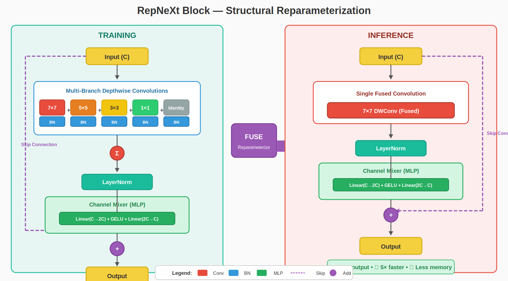
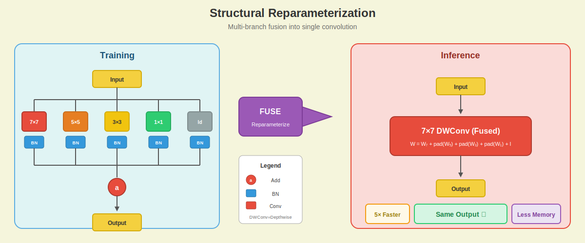
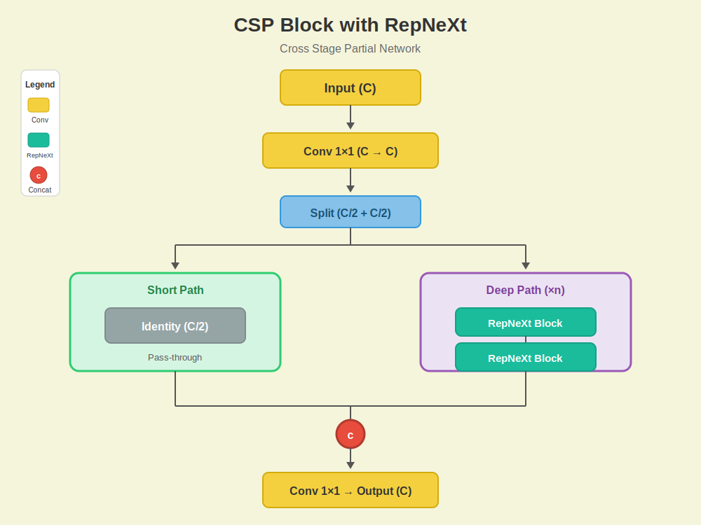
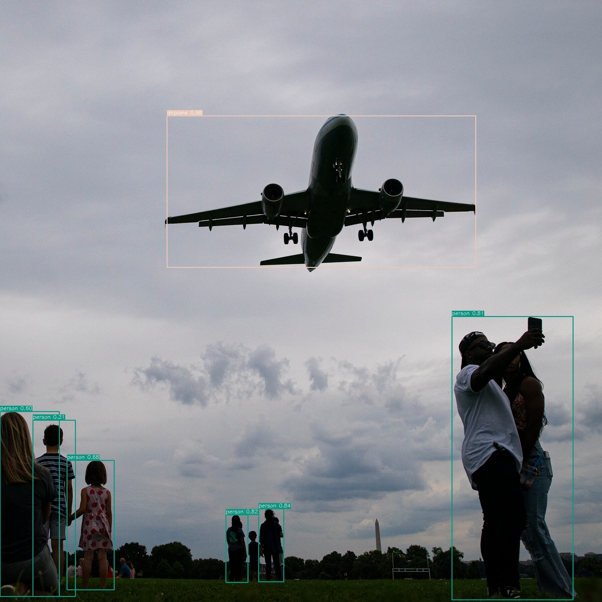

# YOLOv8-RepNeXt

Welcome to this PyTorch implementation of YOLOv8 with RepNeXt.

This project focuses on building a fast and accurate object detection model that’s also easy to train and deploy. It’s based on the RepNeXt paper, which uses a smart idea: during training, the model learns with multiple convolution branches, but at inference time, everything is fused into a single efficient layer.

#### What does that mean for you?

    ####  Better feature learning while training
    ####  Faster and lighter inference when deploying

This project is inspired by the [RepNeXt paper](https://arxiv.org/abs/2406.16004) — a clever approach that uses multiple convolutional branches during training but fuses them into a single efficient layer at inference time. The result? You get the best of both worlds: rich feature learning during training and blazing-fast inference.

---

## What Makes This Special?

The magic lies in **structural reparameterization**. Here's the idea in plain terms:

- **During training**, the model uses 5 parallel branches (7×7, 5×5, 3×3, 1×1, and identity) to capture features at different scales
- **During inference**, all those branches get mathematically fused into a single 7×7 convolution
- **The result**: Same accuracy, way faster inference — no tricks, just math!


---

## RepNeXt Block — The Core Innovation

The RepNeXt block is where the magic happens. During training, it uses multiple parallel branches to learn rich features:



### How Reparameterization Works

At inference time, all those branches are mathematically fused into a single convolution. No accuracy loss, just pure speed:



---

## CSP Block Design

We use Cross Stage Partial (CSP) blocks with RepNeXt for better gradient flow and reduced computation:



---

## Getting Started

### Installation

Clone the repo and install dependencies:

```bash
git clone https://github.com/Gaurav14cs17/YOLOV8-Pytorch.git
cd YOLOV8-Pytorch
pip install -r requirements.txt
```

### Your First Model

Creating a model is straightforward:

```python
from model import yolo_v8_n, yolo_v8_s, yolo_v8_m

# Pick the size that fits your needs
model = yolo_v8_n(num_classes=80)   # Nano - fastest, good for edge devices
model = yolo_v8_s(num_classes=80)   # Small - nice balance
model = yolo_v8_m(num_classes=80)   # Medium - when you need more accuracy

# Test it out
import torch
x = torch.randn(1, 3, 640, 640)
outputs = model(x)
```

### Speed Up Inference

Before deploying, reparameterize the model to fuse all branches:

```python
model.eval()
model.reparameterize()

# Now it's faster!
with torch.no_grad():
    outputs = model(x)
```

---

## Training Your Own Model

### Standard Training

```bash
python train.py --train --epochs 100 --batch-size 16 --input-size 640
```

### Quantization-Aware Training

Want to deploy on edge devices? Use QAT for better performance on limited hardware:

```bash
python qtrain.py --train --epochs 20 --batch-size 32
```

Training outputs are saved to different folders:
- Standard training → `weights/`
- Quantized training → `weights_quant/`

### Dataset Setup

Organize your data in YOLO format:

```
dataset/
├── images/
│   ├── train/
│   └── val/
└── labels/
    ├── train/
    └── val/
```

Each label file should have one line per object:
```
class_id x_center y_center width height
```
All coordinates are normalized to 0-1.

---

## Running Inference

### Standard Model

```bash
python inference.py \
    --weights weights/best.pt \
    --source path/to/image.jpg \
    --conf-thres 0.25 \
    --iou-thres 0.45 \
    --save
```

### Quantized Model

```bash
python qinference.py \
    --weights weights_quant/best.pt \
    --source path/to/image.jpg \
    --conf-thres 0.25 \
    --save
```

---

## Model Variants

Choose based on your speed/accuracy tradeoff:

| Variant | Parameters | Use Case |
|---------|------------|----------|
| nano | ~3M | Edge devices, real-time on CPU |
| tiny | ~5M | Mobile devices |
| small | ~11M | Good balance for most cases |
| medium | ~26M | When accuracy matters more |
| large | ~44M | High accuracy applications |
| xlarge | ~68M | Maximum accuracy |

---

## Configuration

All settings live in `config/config.yml`. Here are the key ones:

```yaml
# Model architecture
variant: 'small'        # nano, tiny, small, medium, large, xlarge
neck_type: 'fpn'        # fpn, lite, bifpn

# Training hyperparameters
lr0: 0.01
momentum: 0.937
weight_decay: 0.0005
epochs: 300

# Data augmentation
mosaic: 0.5            # Mosaic augmentation probability
mixup: 0.1             # MixUp augmentation probability
hsv_h: 0.015           # Hue shift
hsv_s: 0.7             # Saturation shift
hsv_v: 0.4             # Value shift

# Your classes
names:
  0: person
  1: bicycle
  # ... add your classes
```

---

## Project Structure

Here's how the code is organized:

```
YOLOV8-Pytorch/
├── model/              # Core model architecture
│   ├── repnext.py      # RepNeXt blocks & reparameterization
│   ├── backbone.py     # Feature extractor
│   ├── neck.py         # FPN/PANet for multi-scale fusion
│   ├── head.py         # Detection head with DFL
│   └── yolo.py         # Complete YOLO model
│
├── qmodel/             # Quantized version for edge deployment
│   ├── repnext.py      # Quantization-friendly RepNeXt
│   ├── yolo.py         # Quantized YOLO model
│   └── pruning.py      # Model pruning utilities
│
├── dataloader/         # Data loading & augmentation
│   ├── dataset.py      # Dataset class
│   ├── augmentations.py# HSV, Flip, MixUp, etc.
│   └── mosaic.py       # Mosaic augmentation
│
├── utils/              # Helper functions
│   ├── boxes.py        # Box operations, NMS
│   ├── metrics.py      # mAP calculation
│   ├── losses.py       # Loss functions
│   └── assigner.py     # Label assignment
│
├── train.py            # Standard training script
├── qtrain.py           # Quantization-aware training
├── inference.py        # Run inference with standard model
├── qinference.py       # Run inference with quantized model
└── config/config.yml   # All your settings
```

---

## Features at a Glance

**Architecture**
- Multi-branch RepNeXt blocks for rich feature learning
- Structural reparameterization for fast inference
- Decoupled detection head with DFL
- Task-aligned label assignment

**Training**
- Mosaic and MixUp augmentation
- EMA (Exponential Moving Average) for stable training
- Mixed precision (FP16) support
- Multi-GPU training with DDP

**Optimization**
- Quantization-aware training for edge deployment
- Model pruning support
- Conv-BN fusion for faster inference

---

## Acknowledgments

This project builds on great work from:
- [YOLO Series Paper](https://arxiv.org/abs/2304.00501) — *"YOLOv1 to YOLOv8, The Rise of Real-Time Object Detection"*
- [RepNeXt Paper](https://arxiv.org/abs/2406.16004) — *"RepNeXt: A Fast Multi-Scale CNN using Structural Reparameterization"*
- [RepNeXt GitHub](https://github.com/suous/RepNeXt) — reference implementation

---

## License

MIT License — use it however you'd like!

---

## Sample Results




