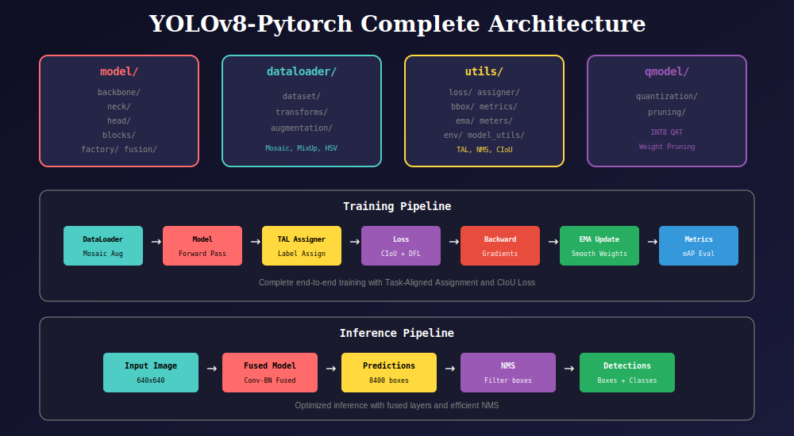

# YOLOv8-PyTorch

A comprehensive, modular PyTorch implementation of YOLOv8 object detection with detailed documentation.



## 🌟 Features

- **Modular Architecture**: Clean separation of backbone, neck, head, and utilities
- **Task-Aligned Assigner (TAL)**: State-of-the-art label assignment
- **Distribution Focal Loss (DFL)**: Advanced box regression
- **Comprehensive Augmentation**: Mosaic, MixUp, HSV, and more
- **Quantization Support**: INT8 quantization-aware training
- **Weight Pruning**: Model compression with minimal accuracy loss
- **Extensive Documentation**: SVG diagrams and detailed READMEs

## 📂 Package Structure

```
YOLOV8-Pytorch/
├── model/                     # 🔵 Model Architecture
│   ├── backbone/              # CSPDarknet backbone
│   ├── neck/                  # FPN/PAN feature pyramid
│   ├── head/                  # Detection head with DFL
│   ├── blocks/                # ConvBlock, CSPBlock, SPPBlock
│   ├── factory/               # Model variants (n/s/m/l/x)
│   ├── fusion/                # Conv-BN fusion for inference
│   └── docs/                  # Architecture diagrams
│
├── dataloader/                # 🟢 Data Loading
│   ├── dataset/               # YOLO Dataset class
│   ├── transforms/            # Coordinate transforms
│   ├── augmentation/          # Mosaic, MixUp, HSV
│   └── docs/                  # Pipeline diagrams
│
├── utils/                     # 🟡 Training Utilities
│   ├── loss/                  # CIoU, DFL loss computation
│   ├── assigner/              # Task-Aligned Assigner
│   ├── bbox/                  # Box operations, NMS
│   ├── metrics/               # mAP computation
│   ├── ema/                   # Exponential Moving Average
│   ├── meters/                # Training statistics
│   ├── model_utils/           # Optimizer utilities
│   └── docs/                  # Utility diagrams
│
├── qmodel/                    # 🟣 Quantized Models
│   ├── quantization/          # QAT implementation
│   ├── pruning/               # Weight pruning
│   └── docs/                  # Compression diagrams
│
├── config/                    # Configuration files
├── train.py                   # Training script
├── inferencing_single.py      # Inference script
└── docs/                      # Project documentation
```

## 🚀 Quick Start

### Installation

```bash
git clone https://github.com/Gaurav14cs17/YOLOV8-Pytorch.git
cd YOLOV8-Pytorch
pip install -r requirements.txt
```

### Create Model

```python
from model import yolo_v8_n, yolo_v8_s, yolo_v8_m

# Create YOLOv8 nano model
model = yolo_v8_n(num_classes=80)

# Or small/medium/large/xlarge
model = yolo_v8_s(num_classes=80)
model = yolo_v8_m(num_classes=80)
```

### Training

```bash
python train.py --train --epochs 300 --batch-size 16 --input-size 640
```

### Inference

```python
from model import yolo_v8_s
from utils import non_max_suppression, scale

# Load model
model = yolo_v8_s(num_classes=80)
model.load_state_dict(torch.load('weights/best.pt')['model'].state_dict())
model.eval()
model.fuse()  # Fuse Conv-BN for faster inference

# Inference
with torch.no_grad():
    predictions = model(images)
    detections = non_max_suppression(predictions, conf_thres=0.25, iou_thres=0.45)
```

## 📊 Model Variants

| Variant | Params | mAP@50 | Speed (ms) | Use Case |
|---------|--------|--------|------------|----------|
| YOLOv8n | 3.2M | 37.3 | 1.0 | Edge devices |
| YOLOv8s | 11.2M | 44.9 | 1.5 | Mobile |
| YOLOv8m | 25.9M | 50.2 | 2.5 | Server |
| YOLOv8l | 43.7M | 52.9 | 3.5 | High accuracy |
| YOLOv8x | 68.2M | 53.9 | 5.0 | Best accuracy |

## 🏗️ Architecture

### Backbone (CSPDarknet)
- 5 stages with increasing channels
- CSP blocks for efficient gradient flow
- SPPF for multi-scale context

### Neck (FPN/PAN)
- Top-down pathway (FPN): Semantic enrichment
- Bottom-up pathway (PAN): Localization enhancement
- Multi-scale feature fusion

### Head (Decoupled)
- Separate box and class branches
- Distribution Focal Loss (DFL) for regression
- Anchor-free design

## 📈 Training Features

### Task-Aligned Assigner (TAL)
```python
from utils import TaskAlignedAssigner

assigner = TaskAlignedAssigner(
    num_classes=80,
    top_k=13,        # Top-K candidates
    alpha=0.5,       # Classification weight
    beta=6.0         # IoU weight
)
```

### Loss Components
- **BCE Loss**: Classification
- **CIoU Loss**: Box regression
- **DFL Loss**: Distribution focal loss

### Data Augmentation
- **Mosaic**: 4-image composition
- **MixUp**: Alpha blending
- **HSV**: Color space augmentation
- **Random Perspective**: Geometric transforms

## ⚡ Model Compression

### Quantization (INT8)

```python
from qmodel import create_quantized_variant, QuantizedYOLO

model = create_quantized_variant('small', num_classes=80)
qat_model = QuantizedYOLO(model)
# Train with QAT...
quantized = torch.quantization.convert(qat_model)
```

### Pruning

```python
from qmodel import create_pruned_variant

pruning_cfg = {'prune_conv': True, 'amount': 0.2}
model = create_pruned_variant('small', num_classes=80, pruning_cfg=pruning_cfg)
```

## 🔧 Configuration

Edit `config/config.yml`:

```yaml
# Model
num_classes: 80
input_size: 640

# Training
lr0: 0.01
momentum: 0.937
weight_decay: 0.0005

# Augmentation
mosaic: 0.5
mixup: 0.1
hsv_h: 0.015
hsv_s: 0.7
hsv_v: 0.4

# Loss
box_weight: 7.5
cls_weight: 0.5
dfl_weight: 1.5
```

## 📦 Dependencies

- PyTorch >= 1.9
- torchvision
- OpenCV
- NumPy
- albumentations (optional)
- tqdm
- PyYAML

## 🎯 Performance Tips

1. **Multi-GPU**: Use `torchrun` for distributed training
2. **Mixed Precision**: Enable with `torch.cuda.amp`
3. **EMA**: Always use EMA for stable training
4. **Layer Fusion**: Fuse Conv-BN for 10-30% speedup
5. **Quantization**: 4x smaller with minimal accuracy loss

## 👤 Author

**Gaurav Goswami** — [@Gaurav14cs17](https://github.com/Gaurav14cs17)

MLE @ Red Hat | Ex-Lead Deep Learning Engineer at Samsung R&D Institute India-Bangalore

[](https://github.com/Gaurav14cs17)
[](https://www.linkedin.com/in/gaurav14cs17/)

## 📄 License

This project is licensed under the MIT License.

## 🙏 Acknowledgments

- [Ultralytics YOLOv8](https://github.com/ultralytics/ultralytics)
- [TOOD: Task-aligned One-stage Object Detection](https://arxiv.org/abs/2108.07755)
- [Generalized Focal Loss](https://arxiv.org/abs/2006.04388)

## 📝 Citation

```bibtex
@software{yolov8_pytorch,
  author = {Gaurav Goswami},
  title = {YOLOv8-PyTorch: Modular Implementation},
  year = {2024},
  url = {https://github.com/Gaurav14cs17/YOLOV8-Pytorch}
}
```

---

### 🚀 Open in Google Colab

<br/>

<p align="center">
  <a href="https://colab.research.google.com/github/Gaurav14cs17/YOLOV8-Pytorch/blob/main/googleColabs/Yolov8_Train.ipynb">
    
  </a>
</p>

<br/>

<p align="center">
  <strong>✨ Click the badge above to open this notebook directly in Google Colab!</strong>
</p>


## 📚 Navigation

| Previous | Up | Next |
|:---------|:--:|-----:|
| - | **Main** | [Model Package →](model/README.md) |

**Documentation Index:**
- [Model Package](model/README.md) - Architecture components
- [Dataloader Package](dataloader/README.md) - Dataset & augmentation
- [Utils Package](utils/README.md) - Training utilities
- [QModel Package](qmodel/README.md) - Quantization & pruning
- [Google Colab](googleColabs/readme.md) - Training notebooks
