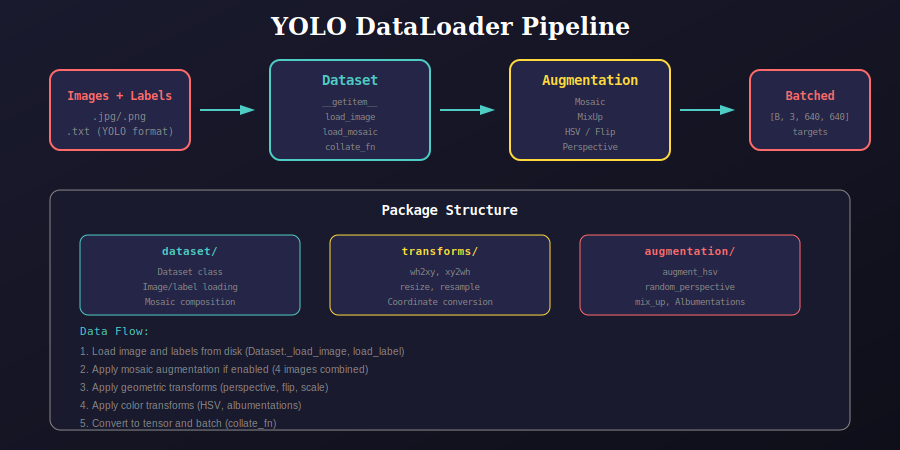
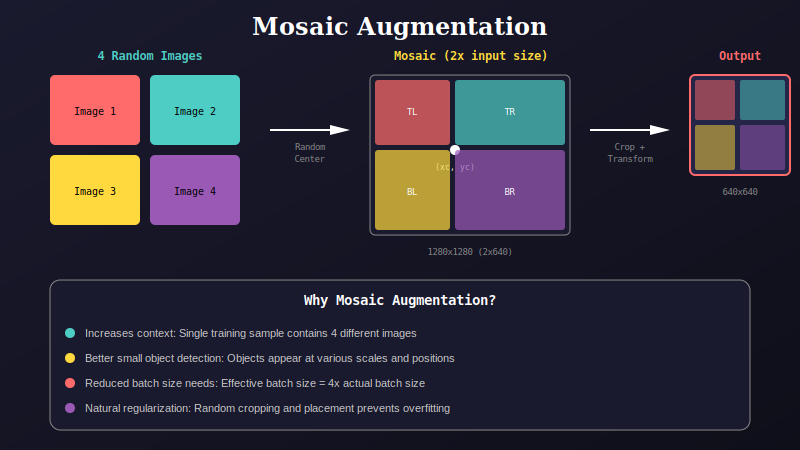
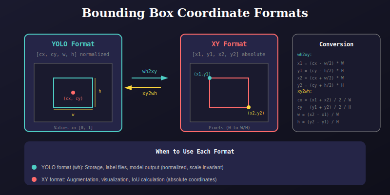

# YOLO DataLoader Package

This package provides comprehensive data loading and augmentation utilities for YOLOv8 object detection training.

## Overview



## Package Structure

```
dataloader/
├── dataset/              # Main Dataset class
│   ├── dataset.py        # Dataset implementation
│   ├── __init__.py
│   └── docs/
├── transforms/           # Coordinate transformations
│   ├── transforms.py     # wh2xy, xy2wh, resize, etc.
│   ├── __init__.py
│   └── docs/
├── augmentation/         # Data augmentation
│   ├── augmentation.py   # HSV, mosaic, mixup, perspective
│   ├── __init__.py
│   └── docs/
├── __init__.py
└── docs/
    ├── 01_dataloader_overview.svg
    ├── 02_mosaic_augmentation.svg
    └── 03_coordinate_formats.svg
```

## Mosaic Augmentation



### How It Works
1. Select 4 random images from the dataset
2. Pick a random center point (xc, yc)
3. Place images in 4 quadrants around the center
4. Crop to target size with random perspective transform

### Benefits
- Increases effective batch size by 4x
- Improves small object detection
- Natural regularization
- Better context understanding

## Coordinate Formats



### YOLO Format (Normalized)
```
[class, cx, cy, w, h]
- cx, cy: center coordinates (0-1)
- w, h: width and height (0-1)
```

### XY Format (Absolute)
```
[x1, y1, x2, y2]
- (x1, y1): top-left corner (pixels)
- (x2, y2): bottom-right corner (pixels)
```

## Quick Start

### Basic Usage

```python
from dataloader import Dataset

# Define augmentation parameters
params = {
    'mosaic': 0.5,      # Mosaic probability
    'mix_up': 0.1,      # MixUp probability
    'hsv_h': 0.015,     # HSV-Hue augmentation
    'hsv_s': 0.7,       # HSV-Saturation
    'hsv_v': 0.4,       # HSV-Value
    'degrees': 0.0,     # Rotation degrees
    'translate': 0.1,   # Translation
    'scale': 0.5,       # Scale
    'shear': 0.0,       # Shear
    'flip_ud': 0.0,     # Flip up-down
    'flip_lr': 0.5,     # Flip left-right
}

# Create dataset
dataset = Dataset(
    filenames=image_paths,
    input_size=640,
    params=params,
    augment=True
)

# Create dataloader
loader = DataLoader(
    dataset,
    batch_size=16,
    shuffle=True,
    num_workers=4,
    collate_fn=Dataset.collate_fn
)
```

### Training Loop

```python
for images, targets, shapes in loader:
    # images: [B, 3, 640, 640] - normalized float tensor
    # targets: [N, 6] - [batch_idx, class, cx, cy, w, h]
    # shapes: original shapes for evaluation
    
    outputs = model(images.to(device))
    loss = criterion(outputs, targets)
```

## Module Details

### Dataset (`dataset/`)

The main `Dataset` class handles:
- Image and label loading
- Label caching for faster subsequent runs
- Mosaic composition
- Coordinate transformation during loading

```python
class Dataset:
    def __init__(filenames, input_size, params, augment):
        """Initialize dataset with image paths and parameters."""
    
    def __getitem__(index):
        """Get single training sample with augmentations."""
    
    def _load_image(i):
        """Load and resize image from disk."""
    
    def _load_mosaic(index, params):
        """Create mosaic from 4 random images."""
    
    @staticmethod
    def collate_fn(batch):
        """Batch collation with target index assignment."""
    
    @staticmethod
    def load_label(filenames):
        """Load and cache all labels."""
```

### Transforms (`transforms/`)

Coordinate transformation utilities:

| Function | Description |
|----------|-------------|
| `wh2xy` | YOLO format to absolute coordinates |
| `xy2wh` | Absolute to YOLO format |
| `resize` | Resize with letterboxing |
| `resample` | Random interpolation method |
| `candidates` | Filter valid transformed boxes |

### Augmentation (`augmentation/`)

Data augmentation functions:

| Function | Description |
|----------|-------------|
| `augment_hsv` | HSV color space augmentation |
| `random_perspective` | Rotation, scale, shear, translation |
| `mix_up` | MixUp augmentation |
| `Albumentations` | Wrapper for albumentations library |

## Augmentation Pipeline

```
1. Load Image
   └── cv2.imread() → BGR image
   
2. Mosaic (if enabled, p=0.5)
   └── Combine 4 images around random center
   
3. MixUp (if enabled, p=0.1)
   └── Blend with another mosaic
   
4. Random Perspective
   ├── Rotation: ±degrees
   ├── Scale: 1-scale to 1+scale
   ├── Shear: ±shear degrees
   └── Translation: ±translate
   
5. HSV Augmentation
   ├── Hue: ±hsv_h
   ├── Saturation: ×(1±hsv_s)
   └── Value: ×(1±hsv_v)
   
6. Flip
   ├── Up-down: p=flip_ud
   └── Left-right: p=flip_lr
   
7. Albumentations (optional)
   ├── Blur
   ├── CLAHE
   └── ToGray
   
8. Convert to Tensor
   └── HWC→CHW, BGR→RGB, /255
```

## Label Format

### Input (txt files)
```
<class_id> <cx> <cy> <w> <h>
0 0.5 0.5 0.2 0.3
1 0.7 0.8 0.1 0.15
```

### Output (target tensor)
```
[batch_idx, class_id, cx, cy, w, h]
```

## Performance Tips

1. **Enable label caching**: First run creates `.cache` file
2. **Adjust num_workers**: Match CPU cores for I/O
3. **Use SSD storage**: Faster random access for images
4. **Tune augmentation**: Reduce for faster training, increase for better generalization

## Dependencies

- PyTorch
- OpenCV (cv2)
- NumPy
- PIL (Pillow)
- albumentations (optional)

## References

- [Mosaic Augmentation (YOLOv4)](https://arxiv.org/abs/2004.10934)
- [MixUp](https://arxiv.org/abs/1710.09412)
- [Random Erasing](https://arxiv.org/abs/1708.04896)

---

## 📚 Navigation

| Previous | Up | Next |
|:---------|:--:|-----:|
| [← Model Package](../model/README.md) | [🏠 Home](../README.md) | [Utils Package →](../utils/README.md) |

**Submodules:**
- [Dataset](dataset/docs/README.md) | [Augmentation](augmentation/docs/README.md) | [Transforms](transforms/docs/README.md)

