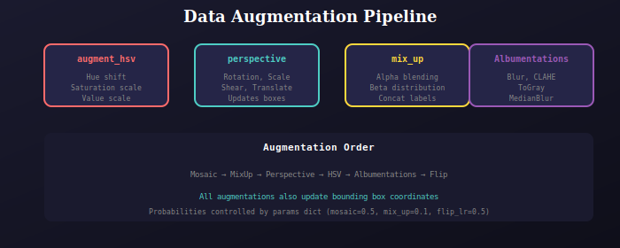

# Data Augmentation

Augmentation functions for object detection training.



## Functions

### augment_hsv
HSV color space augmentation:
```python
augment_hsv(image, params)
# params: hsv_h, hsv_s, hsv_v
```

### random_perspective
Geometric transformations:
```python
image, labels = random_perspective(image, labels, params, border)
# Applies: rotation, scale, shear, translation
# Also transforms bounding box coordinates
```

### mix_up
MixUp augmentation (alpha blending):
```python
image, labels = mix_up(image1, labels1, image2, labels2)
# Uses Beta(32, 32) distribution for alpha
```

### Albumentations
Wrapper for albumentations library:
```python
aug = Albumentations()
image, labels = aug(image, labels)
# Applies: Blur, CLAHE, ToGray, MedianBlur
```

## Parameters

```python
params = {
    'mosaic': 0.5,      # Mosaic probability
    'mix_up': 0.1,      # MixUp probability
    'hsv_h': 0.015,     # Hue range
    'hsv_s': 0.7,       # Saturation range
    'hsv_v': 0.4,       # Value range
    'degrees': 0.0,     # Rotation degrees
    'translate': 0.1,   # Translation fraction
    'scale': 0.5,       # Scale range
    'shear': 0.0,       # Shear degrees
    'flip_ud': 0.0,     # Flip up-down prob
    'flip_lr': 0.5,     # Flip left-right prob
}
```

---

## 📚 Navigation

| Previous | Up | Next |
|:---------|:--:|-----:|
| [← Dataset](../../dataset/docs/README.md) | [🏠 Dataloader](../../README.md) | [Transforms →](../../transforms/docs/README.md) |

