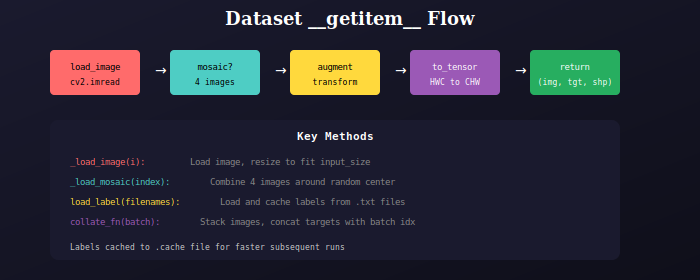

# YOLO Dataset

Main dataset class for object detection training.



## Features

- Mosaic augmentation (4-image composition)
- MixUp augmentation (alpha blending)
- Label caching for fast loading
- Custom collate function for batching

## Usage

```python
from dataloader import Dataset

dataset = Dataset(
    filenames=image_paths,
    input_size=640,
    params=augmentation_params,
    augment=True
)

loader = DataLoader(
    dataset,
    batch_size=16,
    collate_fn=Dataset.collate_fn
)
```

## Label Format

Input `.txt` files (YOLO format):
```
class cx cy w h
0 0.5 0.5 0.2 0.3
1 0.7 0.8 0.1 0.15
```

Output target tensor:
```
[batch_idx, class, cx, cy, w, h]
```

## Key Methods

| Method | Description |
|--------|-------------|
| `__getitem__` | Get single sample with augmentation |
| `_load_image` | Load and resize image |
| `_load_mosaic` | Create mosaic from 4 images |
| `load_label` | Load and cache all labels |
| `collate_fn` | Batch collation function |

---

## 📚 Navigation

| Previous | Up | Next |
|:---------|:--:|-----:|
| [← Dataloader Package](../../README.md) | [🏠 Dataloader](../../README.md) | [Augmentation →](../../augmentation/docs/README.md) |

