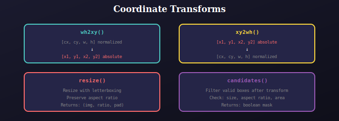

# Coordinate Transforms

Coordinate transformation utilities for bounding boxes.



## Functions

### wh2xy
Convert YOLO format to corner format:
```python
# Input: [cx, cy, w, h] normalized (0-1)
# Output: [x1, y1, x2, y2] absolute (pixels)
boxes = wh2xy(boxes, w=640, h=640, pad_w=0, pad_h=0)
```

### xy2wh
Convert corner format to YOLO format:
```python
# Input: [x1, y1, x2, y2] absolute
# Output: [cx, cy, w, h] normalized
boxes = xy2wh(boxes, w=640, h=640)
```

### resize
Resize image with letterboxing:
```python
# Maintains aspect ratio, pads to target size
image, ratio, pad = resize(image, input_size=640, augment=True)
```

### resample
Get random interpolation method for augmentation:
```python
interp = resample()  # INTER_AREA, INTER_CUBIC, etc.
```

### candidates
Filter valid boxes after transformation:
```python
# Returns mask of boxes that are still valid
mask = candidates(original_boxes, transformed_boxes)
```

---

## 📚 Navigation

| Previous | Up | Next |
|:---------|:--:|-----:|
| [← Augmentation](../../augmentation/docs/README.md) | [🏠 Dataloader](../../README.md) | [Utils Package →](../../../utils/README.md) |

