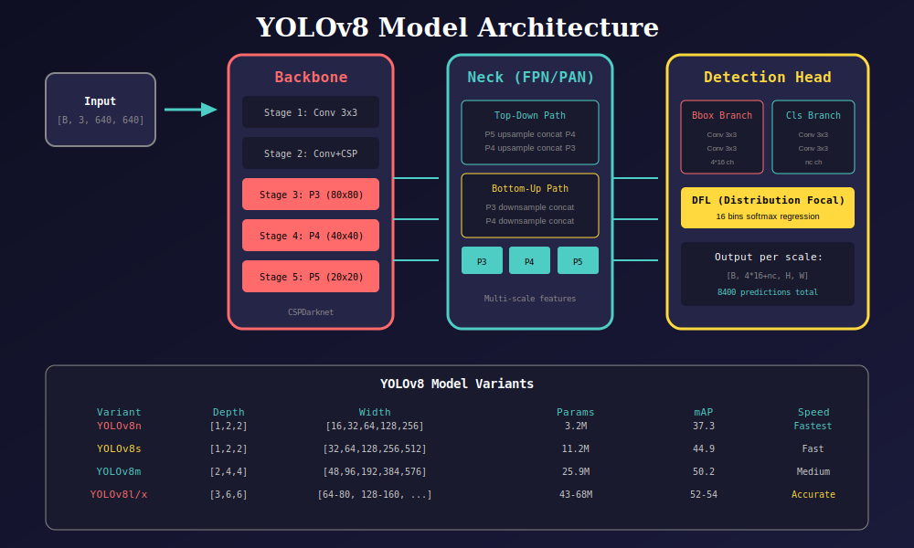
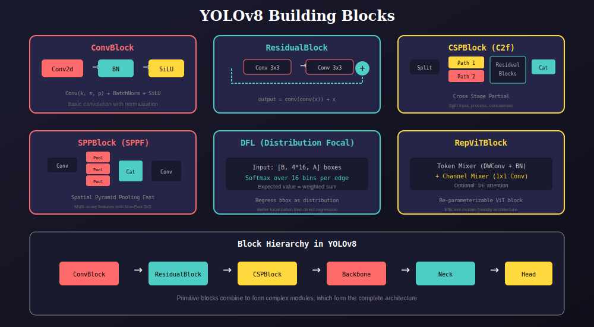
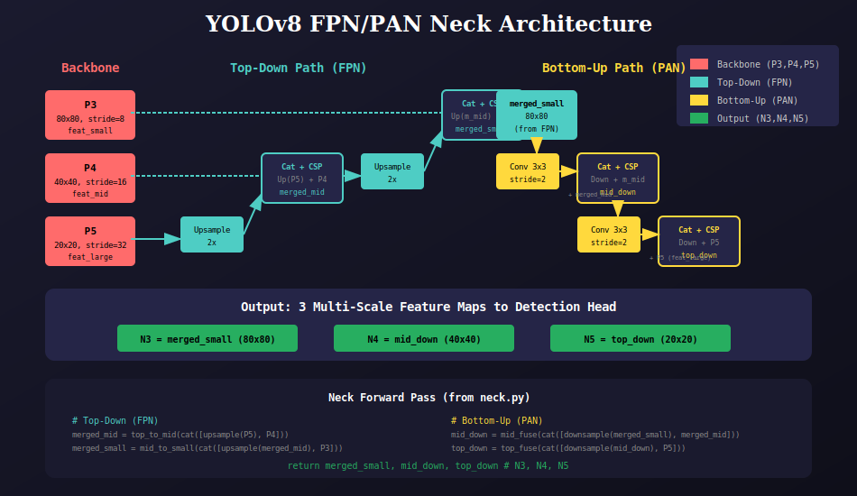
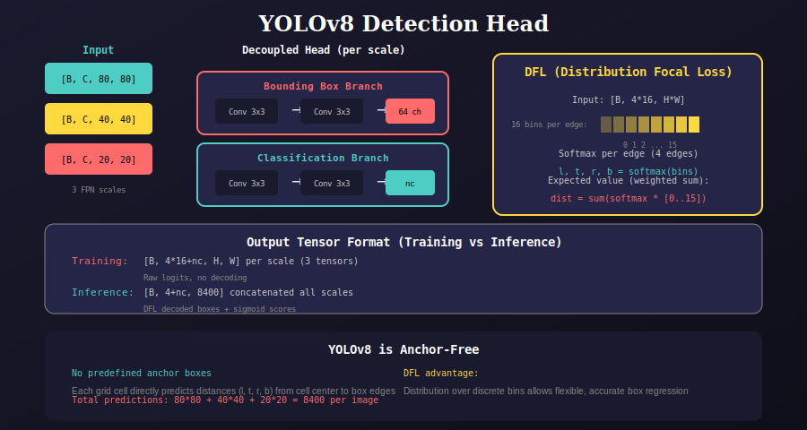
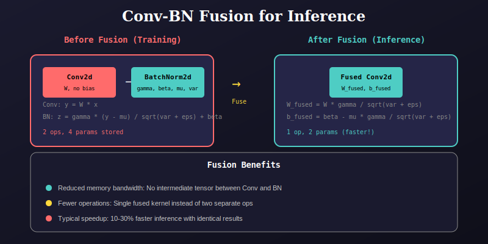

# YOLOv8 Model Package

This package contains the complete implementation of YOLOv8 object detection architecture.

## Architecture Overview



## Package Structure

```
model/
├── blocks/             # Basic building blocks
│   ├── blocks.py       # ConvBlock, CSPBlock, SPPBlock, etc.
│   ├── __init__.py
│   └── docs/
├── backbone/           # Feature extraction backbone
│   ├── backbone.py     # CSPDarknet backbone
│   ├── __init__.py
│   └── docs/
├── neck/               # Feature pyramid network
│   ├── neck.py         # FPN/PAN neck
│   ├── __init__.py
│   └── docs/
├── head/               # Detection head
│   ├── head.py         # DFL head with decoupled branches
│   ├── __init__.py
│   └── docs/
├── factory/            # Model variant factories
│   ├── model.py        # yolo_v8_n/s/m/l/x
│   ├── __init__.py
│   └── docs/
├── fusion/             # Layer fusion utilities
│   ├── fuse_layer.py   # Conv-BN fusion
│   ├── __init__.py
│   └── docs/
├── yolo.py             # Main YOLO class
├── __init__.py
└── docs/               # Package documentation
    ├── 01_architecture_overview.svg
    ├── 02_blocks_overview.svg
    ├── 03_fpn_pan_neck.svg
    ├── 04_head_detection.svg
    └── 05_fusion_inference.svg
```

## Building Blocks



### Core Components

| Block | Description | Usage |
|-------|-------------|-------|
| **ConvBlock** | Conv2d + BatchNorm + SiLU | Basic convolution unit |
| **ResidualBlock** | Two Conv3x3 with skip connection | Gradient flow |
| **CSPBlock** | Cross-Stage Partial block | Efficient feature extraction |
| **SPPBlock** | Spatial Pyramid Pooling Fast | Multi-scale context |
| **DFL** | Distribution Focal Loss layer | Accurate box regression |

## Neck Architecture (FPN/PAN)



The neck combines:
- **FPN (Top-Down)**: Propagates semantic information to lower scales
- **PAN (Bottom-Up)**: Re-propagates localization features upward

## Detection Head



### Key Features
- **Decoupled Head**: Separate branches for box and class predictions
- **Anchor-Free**: Direct distance regression (no predefined anchors)
- **DFL**: Distribution over 16 bins for precise localization

## Layer Fusion



Conv-BN fusion for faster inference without changing results.

## Quick Start

### Create Model

```python
from model import yolo_v8_n, yolo_v8_s, yolo_v8_m, yolo_v8_l, yolo_v8_x

# Nano model (fastest)
model = yolo_v8_n(num_classes=80)

# Small model
model = yolo_v8_s(num_classes=80)

# Medium model
model = yolo_v8_m(num_classes=80)
```

### Model Variants

| Variant | Depth | Width | Params | mAP | Speed |
|---------|-------|-------|--------|-----|-------|
| YOLOv8n | [1,2,2] | [16,32,64,128,256] | 3.2M | 37.3 | Fastest |
| YOLOv8s | [1,2,2] | [32,64,128,256,512] | 11.2M | 44.9 | Fast |
| YOLOv8m | [2,4,4] | [48,96,192,384,576] | 25.9M | 50.2 | Medium |
| YOLOv8l | [3,6,6] | [64,128,256,512,512] | 43.7M | 52.9 | Slower |
| YOLOv8x | [3,6,6] | [80,160,320,640,640] | 68.2M | 53.9 | Slowest |

### Training Mode

```python
model.train()
outputs = model(images)  # Returns list of 3 feature maps
# outputs[0]: [B, 80+64, 80, 80]  # 64 = 4*16 for DFL
# outputs[1]: [B, 80+64, 40, 40]
# outputs[2]: [B, 80+64, 20, 20]
```

### Inference Mode

```python
model.eval()
model.fuse()  # Fuse Conv-BN for faster inference

with torch.no_grad():
    predictions = model(images)
    # predictions: [B, 84, 8400]  # 84 = 4 (box) + 80 (classes)
```

## Module Details

### Backbone
Extracts multi-scale features using CSPDarknet:
- Stage 1-2: Initial downsampling
- Stage 3: P3 features (80x80, stride 8)
- Stage 4: P4 features (40x40, stride 16)
- Stage 5: P5 features (20x20, stride 32) with SPPF

### Neck
Bidirectional feature fusion:
- Top-down: Semantic enrichment via upsampling
- Bottom-up: Localization enhancement via downsampling

### Head
Anchor-free detection with:
- Separate regression and classification branches
- DFL for bounding box regression
- Total 8400 predictions per image

## Advanced Usage

### Custom Backbone

```python
from model.blocks import ConvBlock, CSPBlock, SPPBlock

class CustomBackbone(torch.nn.Module):
    def __init__(self, width, depth):
        super().__init__()
        # Define custom stages
        ...
```

### RepViT Integration

```python
from model.blocks import RepViTBlock, RepViTCSPBlock

# Use RepViT for mobile deployment
block = RepViTBlock(dim=64, use_se=True)

# Switch to inference mode with reparameterization
block.eval()
block.reparameterize()
```

## References

- [YOLOv8 Paper](https://arxiv.org/abs/2305.09972)
- [CSPNet](https://arxiv.org/abs/1911.11929)
- [PANet](https://arxiv.org/abs/1803.01534)
- [Distribution Focal Loss](https://arxiv.org/abs/2006.04388)

---

## 📚 Navigation

| Previous | Up | Next |
|:---------|:--:|-----:|
| [← Main README](../README.md) | [🏠 Home](../README.md) | [Dataloader Package →](../dataloader/README.md) |

**Submodules:**
- [Backbone](backbone/docs/README.md) | [Neck](neck/docs/README.md) | [Head](head/docs/README.md) | [Blocks](blocks/docs/README.md)
- [Factory](factory/docs/README.md) | [Fusion](fusion/docs/README.md) | [Variants](variants/docs/README.md) | [YOLO Core](yolo_core/docs/README.md)

