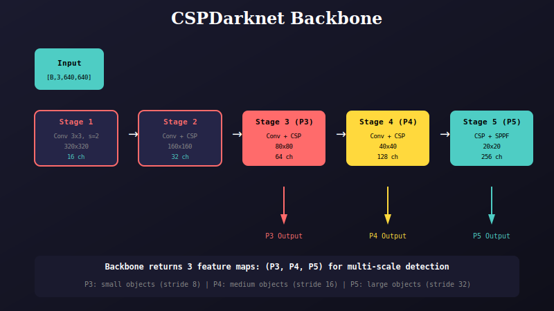

# YOLOv8 Backbone

CSPDarknet backbone for multi-scale feature extraction.

## Architecture



## Overview

The backbone extracts features at multiple scales using a 5-stage CSPDarknet architecture.

```python
class Backbone(torch.nn.Module):
    def __init__(self, width, depth):
        self.stage1 = Conv(3x3, stride=2)           # 320x320
        self.stage2 = Conv + CSPBlock               # 160x160  
        self.stage3 = Conv + CSPBlock               # 80x80   → P3
        self.stage4 = Conv + CSPBlock               # 40x40   → P4
        self.stage5 = Conv + CSPBlock + SPPF        # 20x20   → P5
    
    def forward(self, x):
        s1 = self.stage1(x)
        s2 = self.stage2(s1)
        s3 = self.stage3(s2)    # Return P3
        s4 = self.stage4(s3)    # Return P4
        s5 = self.stage5(s4)    # Return P5
        return s3, s4, s5
```

## Feature Pyramid

| Stage | Resolution | Channels | Stride | Objects |
|-------|------------|----------|--------|---------|
| P3 | 80×80 | 64 | 8 | Small |
| P4 | 40×40 | 128 | 16 | Medium |
| P5 | 20×20 | 256 | 32 | Large |

## Width/Depth Scaling

| Variant | Depth | Width Channels |
|---------|-------|----------------|
| nano | [1,2,2] | [16,32,64,128,256] |
| small | [1,2,2] | [32,64,128,256,512] |
| medium | [2,4,4] | [48,96,192,384,576] |

---

## 📚 Navigation

| Previous | Up | Next |
|:---------|:--:|-----:|
| [← Model Package](../../README.md) | [🏠 Model](../../README.md) | [Neck →](../../neck/docs/README.md) |

