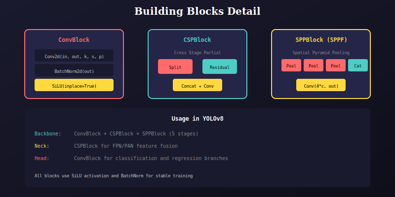

# YOLOv8 Building Blocks

Core building blocks for the YOLOv8 architecture.



## Components

### ConvBlock
Standard convolution block: Conv2d → BatchNorm → SiLU

```python
class ConvBlock(nn.Module):
    def __init__(self, in_ch, out_ch, k=1, s=1, p=None, d=1, g=1):
        self.conv = nn.Conv2d(in_ch, out_ch, k, s, pad(k, p, d), d, g, bias=False)
        self.bn = nn.BatchNorm2d(out_ch, 0.001, 0.03)
        self.act = nn.SiLU(inplace=True)
```

### CSPBlock (C2f)
Cross Stage Partial block with residual connections:
- Split input into two paths
- Process one path through residual blocks
- Concatenate all features

### SPPBlock (SPPF)
Spatial Pyramid Pooling Fast:
- Multiple max pooling with same kernel (5x5)
- Concatenate multi-scale features
- Reduce computation vs original SPP

### ResidualBlock
Basic residual block with optional skip connection.

### RepViTBlock
Re-parameterizable Vision Transformer block for mobile.

---

## 📚 Navigation

| Previous | Up | Next |
|:---------|:--:|-----:|
| [← Head](../../head/docs/README.md) | [🏠 Model](../../README.md) | [Factory →](../../factory/docs/README.md) |

