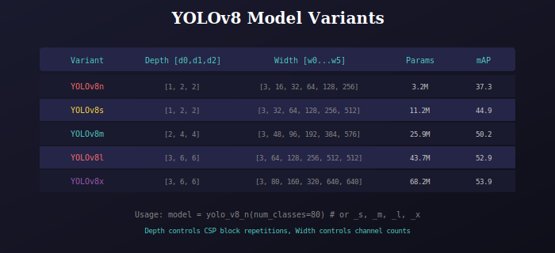

# YOLOv8 Model Factory

Factory functions to create different YOLOv8 model variants.



## Available Variants

| Function | Use Case | Speed | Accuracy |
|----------|----------|-------|----------|
| `yolo_v8_n()` | Edge devices | Fastest | Lower |
| `yolo_v8_s()` | Mobile | Fast | Good |
| `yolo_v8_m()` | Server | Medium | Better |
| `yolo_v8_l()` | High-end GPU | Slower | High |
| `yolo_v8_x()` | Best accuracy | Slowest | Highest |

## Usage

```python
from model import yolo_v8_n, yolo_v8_s, yolo_v8_m, yolo_v8_l, yolo_v8_x

# Create nano model (fastest)
model = yolo_v8_n(num_classes=80)

# Create small model (balanced)
model = yolo_v8_s(num_classes=80)

# Create medium model (recommended)
model = yolo_v8_m(num_classes=80)
```

## Implementation

```python
def yolo_v8_n(num_classes=80):
    depth = [1, 2, 2]
    width = [3, 16, 32, 64, 128, 256]
    return YOLO(width, depth, num_classes)

def yolo_v8_s(num_classes=80):
    depth = [1, 2, 2]
    width = [3, 32, 64, 128, 256, 512]
    return YOLO(width, depth, num_classes)
```

## Scaling Rules

- **Depth**: Controls number of CSP block repetitions
- **Width**: Controls channel count at each stage
- Trade-off: Larger = more accurate but slower

---

## 📚 Navigation

| Previous | Up | Next |
|:---------|:--:|-----:|
| [← Blocks](../../blocks/docs/README.md) | [🏠 Model](../../README.md) | [Fusion →](../../fusion/docs/README.md) |

