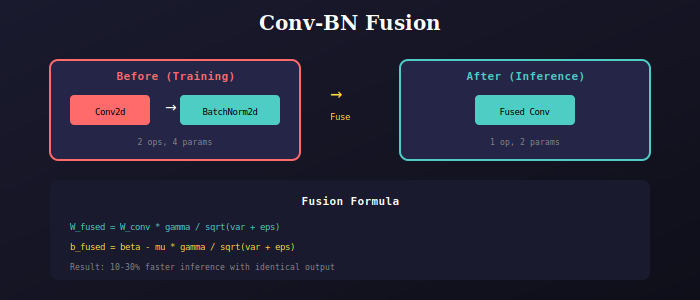

# Conv-BN Fusion

Layer fusion utilities for faster inference.



## Why Fusion?

During training, Conv2d and BatchNorm2d are separate layers. For inference, they can be mathematically combined into a single Conv2d layer, providing:

- **Reduced operations**: 1 op instead of 2
- **Lower memory bandwidth**: No intermediate tensor
- **Faster inference**: 10-30% speedup

## Usage

```python
model.eval()  # Set to eval mode first
model.fuse()  # Fuse Conv-BN layers

# Now run fast inference
with torch.no_grad():
    predictions = model(images)
```

## Implementation

```python
def fuse_conv_bn(conv, bn):
    """Fuse Conv2d and BatchNorm2d into one Conv2d"""
    fused_conv = nn.Conv2d(
        conv.in_channels, conv.out_channels,
        kernel_size=conv.kernel_size,
        stride=conv.stride,
        padding=conv.padding,
        groups=conv.groups,
        bias=True
    )
    
    # Compute fused weights
    w_conv = conv.weight.view(conv.out_channels, -1)
    w_bn = torch.diag(bn.weight / torch.sqrt(bn.running_var + bn.eps))
    fused_conv.weight = torch.mm(w_bn, w_conv).view(fused_conv.weight.shape)
    
    # Compute fused bias
    b_bn = bn.bias - bn.weight * bn.running_mean / torch.sqrt(bn.running_var + bn.eps)
    fused_conv.bias = b_bn
    
    return fused_conv
```

## Notes

- Only fuse during **inference** (not training)
- Fusion is automatic when calling `model.fuse()`
- All ConvBlock modules in backbone, neck, and head are fused

---

## 📚 Navigation

| Previous | Up | Next |
|:---------|:--:|-----:|
| [← Factory](../../factory/docs/README.md) | [🏠 Model](../../README.md) | [Variants →](../../variants/docs/README.md) |

