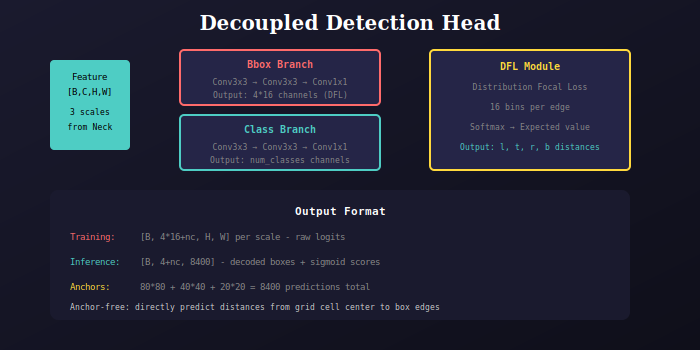

# YOLOv8 Detection Head

Anchor-free decoupled detection head with DFL.



## Architecture

### Decoupled Design
Separate branches for box regression and classification:
- **Bbox Branch**: Conv3x3 → Conv3x3 → Conv1x1(64 channels)
- **Class Branch**: Conv3x3 → Conv3x3 → Conv1x1(num_classes)

### DFL (Distribution Focal Loss)
Instead of directly regressing box coordinates:
- Predicts distribution over 16 discrete bins
- Apply softmax to get probabilities
- Compute expected value as final distance

```python
class DFL(nn.Module):
    def __init__(self, ch=16):
        self.ch = ch  # 16 bins
        self.conv = nn.Conv2d(ch, 1, 1, bias=False)
        self.conv.weight.data[:] = torch.arange(ch).view(1, ch, 1, 1)
    
    def forward(self, x):
        # x: [B, 4*16, H*W]
        x = x.view(b, 4, self.ch, a).transpose(2, 1)
        return self.conv(x.softmax(1)).view(b, 4, a)
```

## Anchor-Free Design

Each grid cell predicts:
- **l, t, r, b**: Distances from cell center to box edges
- **class scores**: Probability for each class

No predefined anchor boxes needed!

## Output

| Mode | Shape | Description |
|------|-------|-------------|
| Training | [B, 80+64, H, W] | Raw logits per scale |
| Inference | [B, 84, 8400] | Decoded boxes + scores |

---

## 📚 Navigation

| Previous | Up | Next |
|:---------|:--:|-----:|
| [← Neck](../../neck/docs/README.md) | [🏠 Model](../../README.md) | [Blocks →](../../blocks/docs/README.md) |

