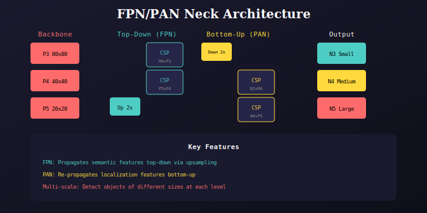

# YOLOv8 Neck (FPN/PAN)

Feature Pyramid Network with Path Aggregation.



## Architecture

The neck combines FPN (Feature Pyramid Network) and PAN (Path Aggregation Network):

### Top-Down Path (FPN)
- Upsamples high-level features (P5 → P4 → P3)
- Propagates semantic information to lower levels
- Uses bilinear upsampling (scale_factor=2)

### Bottom-Up Path (PAN)
- Downsamples fused features (N3 → N4 → N5)
- Re-propagates localization information
- Uses strided convolution (stride=2)

## Implementation

```python
class Neck(nn.Module):
    def __init__(self, width, depth):
        # Top-down
        self.top_to_mid = CSPBlock(w[4]+w[5], w[4], depth[0], add=False)
        self.mid_to_small = CSPBlock(w[3]+w[4], w[3], depth[0], add=False)
        
        # Bottom-up
        self.downsample_mid = ConvBlock(w[3], w[3], 3, 2)
        self.mid_fuse = CSPBlock(w[3]+w[4], w[4], depth[0], add=False)
        self.downsample_top = ConvBlock(w[4], w[4], 3, 2)
        self.top_fuse = CSPBlock(w[4]+w[5], w[5], depth[0], add=False)
```

## Output Scales

| Scale | Resolution | Stride | Object Size |
|-------|------------|--------|-------------|
| N3 | 80×80 | 8 | Small |
| N4 | 40×40 | 16 | Medium |
| N5 | 20×20 | 32 | Large |

---

## 📚 Navigation

| Previous | Up | Next |
|:---------|:--:|-----:|
| [← Backbone](../../backbone/docs/README.md) | [🏠 Model](../../README.md) | [Head →](../../head/docs/README.md) |

