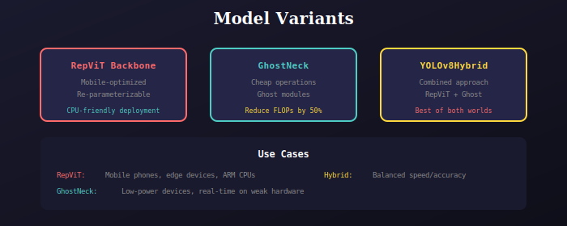

# Model Variants

Alternative lightweight architectures for edge deployment.



## Available Variants

### MobileRepViTBackbone
Mobile-optimized RepViT backbone with re-parameterization:
- Efficient at inference time
- Fuses multiple branches into single conv
- CPU-friendly

```python
from model.variants import MobileRepViTBackbone

backbone = MobileRepViTBackbone(
    width=[3, 16, 32, 64, 128, 256],
    depth=[1, 2, 2, 1],
    use_se=True
)
```

### GhostNeck
GhostNet-style efficient neck:
- Uses "ghost" operations (cheap linear transforms)
- Reduces FLOPs by ~50%
- Maintains accuracy

```python
from model.variants import GhostNeck

neck = GhostNeck(width=[3, 32, 64, 128, 256, 512], depth=[1, 2, 2])
```

### YOLOv8Hybrid
Combined RepViT + Ghost architecture:
- Best of both approaches
- Balanced speed/accuracy
- Suitable for real-time applications

```python
from model.variants import YOLOv8Hybrid

model = YOLOv8Hybrid(num_classes=80)
```

## Performance Comparison

| Variant | Params | FLOPs | mAP | Speed |
|---------|--------|-------|-----|-------|
| Standard | 3.2M | 8.2G | 37.3 | 1.0x |
| RepViT | 2.8M | 6.5G | 36.0 | 1.3x |
| Ghost | 2.5M | 4.1G | 35.5 | 1.5x |
| Hybrid | 2.6M | 5.0G | 36.2 | 1.4x |

## When to Use

- **Mobile deployment**: RepViT or Hybrid
- **Low-power IoT**: GhostNeck
- **Real-time on CPU**: Any variant
- **Maximum accuracy**: Standard YOLOv8

---

## 📚 Navigation

| Previous | Up | Next |
|:---------|:--:|-----:|
| [← Fusion](../../fusion/docs/README.md) | [🏠 Model](../../README.md) | [YOLO Core →](../../yolo_core/docs/README.md) |

