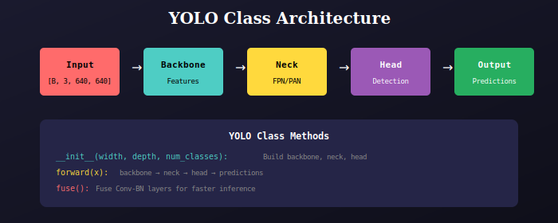

# YOLO Core

Main YOLO model class that integrates backbone, neck, and head.



## Architecture

```python
class YOLO(nn.Module):
    def __init__(self, width, depth, num_classes):
        self.backbone = Backbone(width, depth)
        self.neck = Neck(width, depth)
        self.head = Head(num_classes, (width[3], width[4], width[5]))
```

## Forward Pass

```
Input Image [B, 3, 640, 640]
    ↓
Backbone → P3, P4, P5 features
    ↓
Neck → N3, N4, N5 fused features
    ↓
Head → Detection predictions
```

## Key Methods

| Method | Description |
|--------|-------------|
| `__init__` | Build model with given width/depth |
| `forward` | Run inference |
| `fuse` | Fuse Conv-BN for faster inference |

## Usage

```python
from model import YOLO, yolo_v8_n

# Direct instantiation
model = YOLO(width=[3,32,64,128,256,512], depth=[1,2,2], num_classes=80)

# Or use factory function
model = yolo_v8_n(num_classes=80)

# Inference
model.eval()
model.fuse()  # Optional: speed up inference
predictions = model(images)
```

---

## 📚 Navigation

| Previous | Up | Next |
|:---------|:--:|-----:|
| [← Variants](../../variants/docs/README.md) | [🏠 Model](../../README.md) | [Dataloader Package →](../../../dataloader/README.md) |

