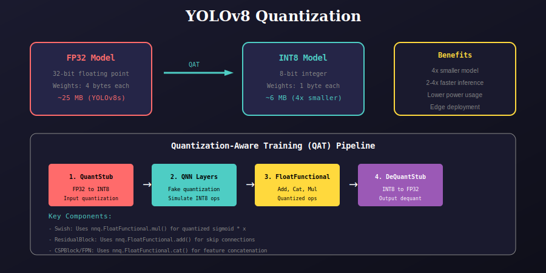
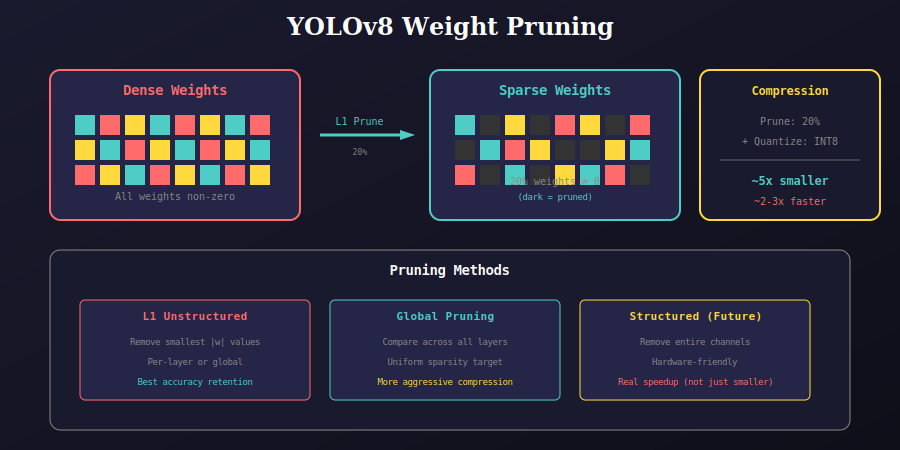

# Quantized YOLOv8 Models

This package provides model compression techniques for efficient YOLOv8 deployment on edge devices.

## Overview

### Quantization



### Pruning



## Package Structure

```
qmodel/
├── quantization/           # Quantization-aware training
│   ├── qyolov8.py          # QAT YOLOv8 implementation
│   ├── __init__.py
│   └── docs/
├── pruning/                # Pruning + Quantization
│   ├── pqyolov8.py         # Pruned + quantized YOLOv8
│   ├── __init__.py
│   └── docs/
├── __init__.py
└── docs/
    ├── 01_quantization_overview.svg
    └── 02_pruning_overview.svg
```

## Key Features

### Quantization-Aware Training (QAT)

| Component | Technique | Purpose |
|-----------|-----------|---------|
| **QuantStub** | FP32 → INT8 | Input quantization |
| **DeQuantStub** | INT8 → FP32 | Output dequantization |
| **FloatFunctional** | Quantized ops | Add, Cat, Mul operations |
| **Swish** | Custom activation | Quantized sigmoid * x |

### Weight Pruning

| Method | Description | Use Case |
|--------|-------------|----------|
| **L1 Unstructured** | Remove smallest weights | Best accuracy |
| **Global Pruning** | Cross-layer comparison | Maximum compression |
| **Structured** | Remove channels | Hardware acceleration |

## Quick Start

### Quantization Only

```python
from qmodel import create_quantized_variant, QuantizedYOLO

# Create base model
model = create_quantized_variant('small', num_classes=80)

# Wrap for QAT
qat_model = QuantizedYOLO(model)

# Training
qat_model.train()
for images, targets in dataloader:
    outputs = qat_model(images)
    loss = criterion(outputs, targets)
    loss.backward()
    optimizer.step()

# Convert to quantized model
qat_model.eval()
quantized_model = torch.quantization.convert(qat_model)
```

### Pruning + Quantization

```python
from qmodel import create_pruned_variant

# Pruning configuration
pruning_cfg = {
    'prune_conv': True,      # Prune conv layers
    'amount': 0.2,           # 20% sparsity
    'global_prune': True,    # Global pruning
    'prune_on_init': False   # Prune during training
}

# Create pruned model
model = create_pruned_variant('small', num_classes=80, pruning_cfg=pruning_cfg)

# Apply global pruning after training
model.prune_model(amount=0.3)  # 30% final sparsity
```

## Model Variants

All standard YOLOv8 variants are supported:

| Variant | Base Size | Quantized | Pruned+Quant |
|---------|-----------|-----------|--------------|
| nano | 6.3 MB | ~1.6 MB | ~1.3 MB |
| tiny | 14 MB | ~3.5 MB | ~2.8 MB |
| small | 25 MB | ~6.3 MB | ~5.0 MB |
| medium | 52 MB | ~13 MB | ~10 MB |
| large | 87 MB | ~22 MB | ~18 MB |
| xlarge | 136 MB | ~34 MB | ~27 MB |

## Implementation Details

### Quantized Operations

```python
class Swish(nn.Module):
    """Quantized Swish activation."""
    def __init__(self):
        super().__init__()
        self.sigmoid = nn.Sigmoid()
        self.quant_ops = nnq.FloatFunctional()

    def forward(self, x):
        # Use quantized multiply
        return self.quant_ops.mul(self.sigmoid(x), x)
```

### Prunable Blocks

```python
class PrunableBlock:
    @staticmethod
    def apply_conv_pruning(module, amount=0.2):
        """Apply L1 unstructured pruning."""
        if isinstance(module, nn.Conv2d):
            prune.l1_unstructured(module, name='weight', amount=amount)
            prune.remove(module, 'weight')  # Make permanent
```

### CSP Block with Quantized Cat

```python
class CSPBlock(nn.Module):
    def __init__(self, ...):
        self.quant_cat = nnq.FloatFunctional()
    
    def forward(self, x):
        features = list(self.initial_conv(x).chunk(2, dim=1))
        for block in self.residual_blocks:
            features.append(block(features[-1]))
        # Use quantized concatenation
        return self.final_conv(self.quant_cat.cat(features, dim=1))
```

## Compression Pipeline

```
1. Train FP32 Model
   └── Standard training with augmentation

2. Quantization-Aware Training
   ├── Insert QuantStub/DeQuantStub
   ├── Use FloatFunctional for ops
   └── Fine-tune for 10-20 epochs

3. (Optional) Pruning
   ├── Apply L1 pruning (20-50%)
   └── Fine-tune to recover accuracy

4. Convert to INT8
   └── torch.quantization.convert()

5. Deploy
   ├── Mobile: TFLite, CoreML
   ├── Edge: TensorRT, ONNX Runtime
   └── Server: ONNXRuntime, OpenVINO
```

## Performance Guidelines

### Accuracy Impact

| Technique | mAP Drop | Speed Gain |
|-----------|----------|------------|
| INT8 only | 0.5-1% | 2-3x |
| Prune 20% | 0.3-0.5% | 1.1x |
| Prune 50% | 1-2% | 1.3x |
| Combined | 1-2% | 3-4x |

### Best Practices

1. **Start with QAT**: Always use QAT instead of post-training quantization
2. **Gradual pruning**: Increase sparsity gradually during training
3. **Fine-tune after pruning**: Essential for accuracy recovery
4. **Calibration data**: Use representative validation subset
5. **Layer sensitivity**: Head layers are more sensitive than backbone

## Hardware Support

| Platform | Quantization | Pruning |
|----------|--------------|---------|
| NVIDIA GPU | TensorRT INT8 | Structured only |
| Intel CPU | VNNI, AVX-512 | Full support |
| ARM CPU | NEON INT8 | Limited |
| Mobile | XNNPACK, QNN | Limited |

## Dependencies

- PyTorch >= 1.9
- torch.quantization
- torch.nn.utils.prune

## References

- [Quantization in PyTorch](https://pytorch.org/docs/stable/quantization.html)
- [Neural Network Pruning](https://arxiv.org/abs/1506.02626)
- [YOLOv8 Quantization Guide](https://docs.ultralytics.com/modes/export/)

---

## 📚 Navigation

| Previous | Up | Next |
|:---------|:--:|-----:|
| [← Utils Package](../utils/README.md) | [🏠 Home](../README.md) | [Google Colab →](../googleColabs/readme.md) |

**Submodules:**
- [Quantization](quantization/docs/README.md) | [Pruning](pruning/docs/README.md)

