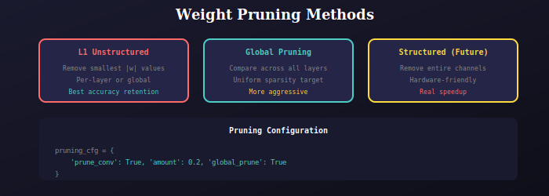

# Weight Pruning

Neural network pruning combined with quantization.



## Overview

Weight pruning removes small/unimportant weights to reduce model size and computation. Combined with quantization, achieves up to 5x compression.

## Methods

### L1 Unstructured Pruning
Remove individual weights with smallest absolute values:
```python
prune.l1_unstructured(module, name='weight', amount=0.2)
prune.remove(module, 'weight')  # Make permanent
```

### Global Pruning
Compare weights across all layers:
```python
parameters = [(m, 'weight') for m in model.modules() if isinstance(m, nn.Conv2d)]
prune.global_unstructured(parameters, prune.L1Unstructured, amount=0.2)
```

## Usage

```python
from qmodel import create_pruned_variant

# Configuration
pruning_cfg = {
    'prune_conv': True,      # Prune conv layers
    'amount': 0.2,           # 20% sparsity
    'global_prune': True,    # Use global pruning
    'prune_on_init': False   # Don't prune immediately
}

# Create model
model = create_pruned_variant('small', num_classes=80, pruning_cfg=pruning_cfg)

# Train normally...

# Apply final pruning
model.prune_model(amount=0.3)
```

## Compression Results

| Method | Size Reduction | mAP Drop |
|--------|----------------|----------|
| INT8 only | 4x | 0.5-1% |
| Prune 20% | 1.25x | 0.3-0.5% |
| Combined | ~5x | 1-2% |

---

## 📚 Navigation

| Previous | Up | Next |
|:---------|:--:|-----:|
| [← Quantization](../../quantization/docs/README.md) | [🏠 QModel](../../README.md) | [Google Colab →](../../../googleColabs/readme.md) |

