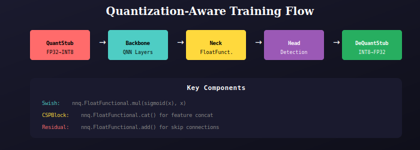

# Quantization-Aware Training

INT8 quantization implementation for YOLOv8.



## Overview

Quantization-Aware Training (QAT) simulates INT8 quantization during training, allowing the model to learn to compensate for quantization errors.

## Key Components

### QuantStub / DeQuantStub
Convert between FP32 and INT8:
```python
self.quant = torch.quantization.QuantStub()
self.dequant = torch.quantization.DeQuantStub()
```

### FloatFunctional
Quantizable operations:
```python
self.quant_ops = nnq.FloatFunctional()
# Usage:
result = self.quant_ops.add(x, residual)  # for skip connections
result = self.quant_ops.cat([a, b], dim=1)  # for concat
result = self.quant_ops.mul(x, y)  # for element-wise multiply
```

## Usage

```python
from qmodel import create_quantized_variant, QuantizedYOLO

# Create model
model = create_quantized_variant('small', num_classes=80)
qat_model = QuantizedYOLO(model)

# Train with QAT
qat_model.train()
for images, targets in dataloader:
    outputs = qat_model(images)
    loss = criterion(outputs, targets)
    loss.backward()
    optimizer.step()

# Convert to fully quantized
qat_model.eval()
quantized = torch.quantization.convert(qat_model)
```

## Benefits

- 4x smaller model size
- 2-4x faster inference
- Minimal accuracy drop (0.5-1% mAP)

---

## 📚 Navigation

| Previous | Up | Next |
|:---------|:--:|-----:|
| [← QModel Package](../../README.md) | [🏠 QModel](../../README.md) | [Pruning →](../../pruning/docs/README.md) |

