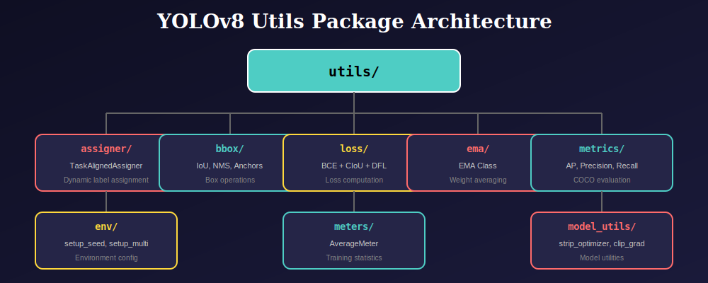
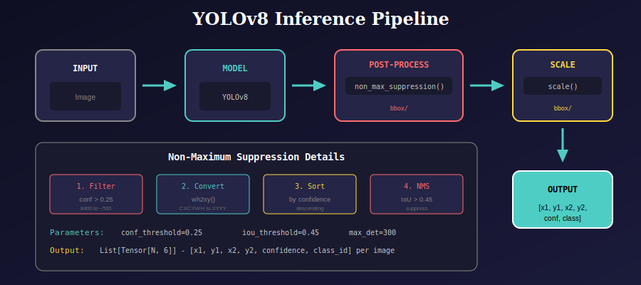

# YOLOv8 Utilities Package

A comprehensive collection of utility modules for YOLOv8 object detection, including loss computation, bounding box operations, metrics, and training utilities.

---

## 📊 Package Architecture



---

## 📁 Package Structure

```
utils/
├── __init__.py              # Main package exports
├── README.md                # This documentation
├── docs/                    # Package-level diagrams
│
├── assigner/                # Label assignment algorithms
│   ├── task_aligned.py      # Task-Aligned Assigner (TAL)
│   └── docs/                # 10 SVG diagrams + README
│
├── bbox/                    # Bounding box operations
│   ├── bbox.py              # IoU, NMS, anchors, coordinate conversion
│   └── docs/                # 5 SVG diagrams + README
│
├── loss/                    # Loss computation
│   ├── loss.py              # ComputeLoss with CIoU + DFL
│   └── docs/                # 4 SVG diagrams + README
│
├── ema/                     # Exponential Moving Average
│   ├── ema.py               # EMA for model weights
│   └── docs/                # 2 SVG diagrams + README
│
├── metrics/                 # Evaluation metrics
│   ├── metrics.py           # AP, Precision, Recall computation
│   └── docs/                # 2 SVG diagrams + README
│
├── meters/                  # Training meters
│   ├── meters.py            # AverageMeter for tracking
│   └── docs/                # 1 SVG diagram + README
│
└── model_utils/             # Model utilities
    ├── model_utils.py       # Optimizer stripping, gradient clipping
    └── docs/                # 1 SVG diagram + README
```

---

## 🚀 Quick Start

### Installation

```python
# All utilities are available from the main package
from utils import (
    # Environment
    setup_seed, setup_multi_processes,
    # Box operations
    scale, make_anchors, box_iou, wh2xy, non_max_suppression,
    # Model utilities
    strip_optimizer, clip_gradients,
    # Metrics
    smooth, compute_ap,
    # Training
    EMA, AverageMeter,
    # Loss
    ComputeLoss,
    # Assigner
    TaskAlignedAssigner
)
```

### Or import from specific modules

```python
from utils.bbox import make_anchors, box_iou
from utils.loss import ComputeLoss
from utils.assigner import TaskAlignedAssigner
```

---

## 📦 Module Overview

### 1. 🎯 Assigner (`utils.assigner`)

**Task-Aligned Assigner (TAL)** - Dynamic label assignment for object detection.

| Export | Description |
|--------|-------------|
| `TaskAlignedAssigner` | Assigns GT to anchors using alignment metric |

**Key Features:**
- Alignment metric: `score^α × IoU^β`
- Top-K selection per ground truth
- Multi-GT conflict resolution
- Soft label generation

📖 [Detailed Documentation](./assigner/docs/README.md)

---

### 2. 📦 Bounding Box (`utils.bbox`)

**Box operations** for object detection pipelines.

| Export | Description |
|--------|-------------|
| `scale` | Scale coordinates from model to image space |
| `make_anchors` | Generate multi-scale anchor points |
| `box_iou` | Compute IoU between box sets |
| `wh2xy` | Convert CXCYWH to XYXY format |
| `non_max_suppression` | NMS post-processing |

📖 [Detailed Documentation](./bbox/docs/README.md)

---

### 3. 📉 Loss (`utils.loss`)

**Loss computation** combining classification, box regression, and DFL.

| Export | Description |
|--------|-------------|
| `ComputeLoss` | Complete YOLO loss with BCE + CIoU + DFL |

**Loss Components:**
- Classification: BCE with Logits
- Box Regression: Complete IoU (CIoU)
- Distribution: Distribution Focal Loss (DFL)

📖 [Detailed Documentation](./loss/docs/README.md)

---

### 4. 📊 EMA (`utils.ema`)

**Exponential Moving Average** for stable model weights.

| Export | Description |
|--------|-------------|
| `EMA` | Maintains smoothed copy of model weights |

**Features:**
- Configurable decay rate
- Ramp-up schedule for early training
- FP32 precision preservation

📖 [Detailed Documentation](./ema/docs/README.md)

---

### 5. 📈 Metrics (`utils.metrics`)

**Evaluation metrics** following COCO protocol.

| Export | Description |
|--------|-------------|
| `smooth` | Box filter for curve smoothing |
| `compute_ap` | Average Precision computation |

**Output Metrics:**
- mAP@0.5 and mAP@0.5:0.95
- Precision, Recall, F1
- Per-class AP

📖 [Detailed Documentation](./metrics/docs/README.md)

---

### 6. 📏 Meters (`utils.meters`)

**Training meters** for tracking statistics.

| Export | Description |
|--------|-------------|
| `AverageMeter` | Computes running weighted averages |

📖 [Detailed Documentation](./meters/docs/README.md)

---

### 7. 🔧 Model Utils (`utils.model_utils`)

**Model utilities** for training and deployment.

| Export | Description |
|--------|-------------|
| `strip_optimizer` | Remove optimizer, convert to FP16 |
| `clip_gradients` | Gradient norm clipping |

📖 [Detailed Documentation](./model_utils/docs/README.md)

---

## 🔄 Training Pipeline


### Training Example

```python
from utils import (
    setup_seed, setup_multi_processes,
    ComputeLoss, EMA, AverageMeter, clip_gradients
)

# Setup environment
setup_seed()
setup_multi_processes()

# Initialize
model = YOLOv8()
loss_fn = ComputeLoss(model, params={'cls': 0.5, 'box': 7.5, 'dfl': 1.5})
ema = EMA(model, decay=0.9999)
loss_meter = AverageMeter()

# Training loop
for epoch in range(epochs):
    loss_meter = AverageMeter()
    
    for batch in train_loader:
        images, targets = batch
        
        # Forward
        outputs = model(images)
        loss = loss_fn(outputs, targets)
        
        # Backward
        optimizer.zero_grad()
        loss.backward()
        clip_gradients(model, max_norm=10.0)
        optimizer.step()
        
        # Update EMA and meters
        ema.update(model)
        loss_meter.update(loss.item(), images.size(0))
    
    print(f"Epoch {epoch}: Loss = {loss_meter.avg:.4f}")

# Use EMA for inference
ema.ema.eval()
```

---

## 🔍 Inference Pipeline



### Inference Example

```python
from utils import non_max_suppression, scale

# Model inference
outputs = model(images)

# Post-processing
detections = non_max_suppression(
    outputs,
    conf_threshold=0.25,
    iou_threshold=0.45
)

# Scale to original image size
for det in detections:
    det[:, :4] = scale(det[:, :4], original_shape, gain, pad)
```

---

## 📊 Evaluation Example

```python
from utils import compute_ap

# After collecting predictions
tp, fp, precision, recall, map50, mean_ap = compute_ap(
    tp_array,      # True positive flags
    conf_array,    # Confidence scores
    pred_cls,      # Predicted classes
    target_cls     # Ground truth classes
)

print(f"mAP@0.5: {map50:.4f}")
print(f"mAP@0.5:0.95: {mean_ap:.4f}")
```

---

## 📚 References

### Papers

| Algorithm | Paper | Year |
|-----------|-------|------|
| **YOLOv8** | Ultralytics | 2023 |
| **Task-Aligned Assigner** | TOOD: Task-aligned One-stage Object Detection | 2021 |
| **CIoU Loss** | Distance-IoU Loss | AAAI 2020 |
| **DFL** | Generalized Focal Loss | NeurIPS 2020 |
| **EMA** | Polyak Averaging | 1992 |
| **COCO Metrics** | Microsoft COCO | ECCV 2014 |

### Links

- [Ultralytics YOLOv8](https://github.com/ultralytics/ultralytics)
- [COCO Dataset](https://cocodataset.org/)
- [PyTorch Documentation](https://pytorch.org/docs/)

---

## 🔗 Dependencies

```
torch>=1.7.0
torchvision>=0.8.0
numpy>=1.19.0
opencv-python>=4.5.0
```

---

## 📄 License

This project follows the same license as the main YOLOv8 repository.

---

## 🤝 Contributing

When adding new utilities:

1. Create a new folder: `utils/new_module/`
2. Add main code: `utils/new_module/new_module.py`
3. Create `__init__.py` with exports
4. Add documentation: `utils/new_module/docs/README.md`
5. Create SVG diagrams for complex concepts
6. Update main `utils/__init__.py` with new exports
7. Update this README with module description

---

## 📚 Navigation

| Previous | Up | Next |
|:---------|:--:|-----:|
| [← Dataloader Package](../dataloader/README.md) | [🏠 Home](../README.md) | [QModel Package →](../qmodel/README.md) |

**Submodules:**
- [Assigner](assigner/docs/README.md) | [BBox](bbox/docs/README.md) | [Loss](loss/docs/README.md) | [EMA](ema/docs/README.md)
- [Metrics](metrics/docs/README.md) | [Meters](meters/docs/README.md) | [Model Utils](model_utils/docs/README.md)
