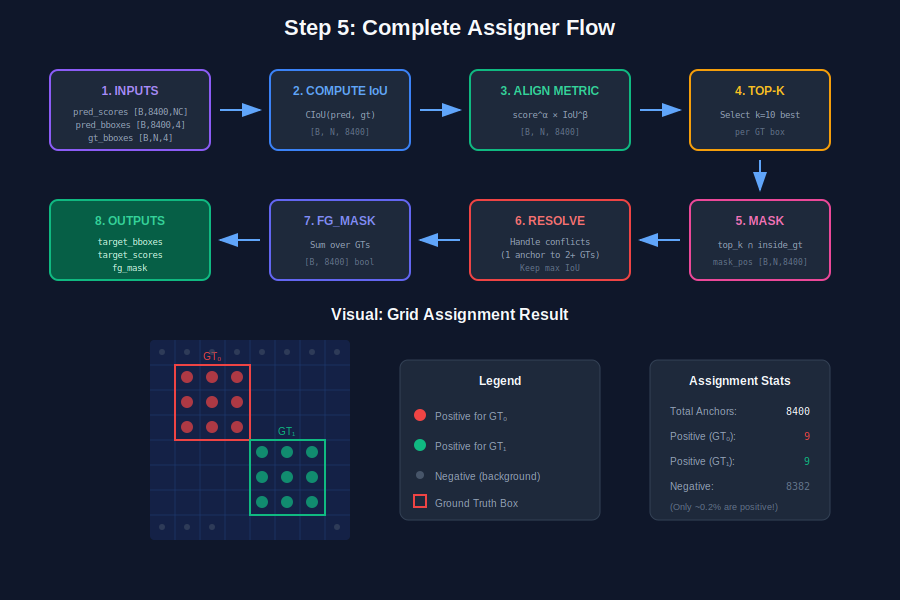
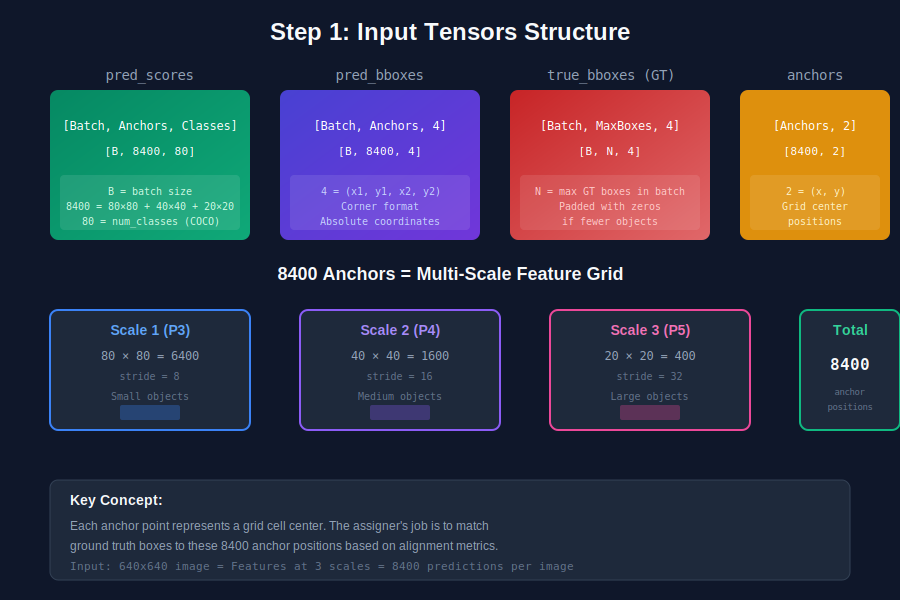
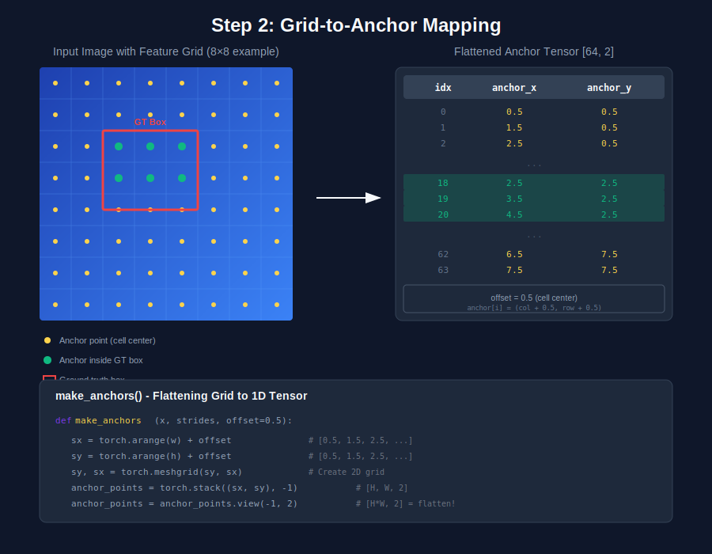
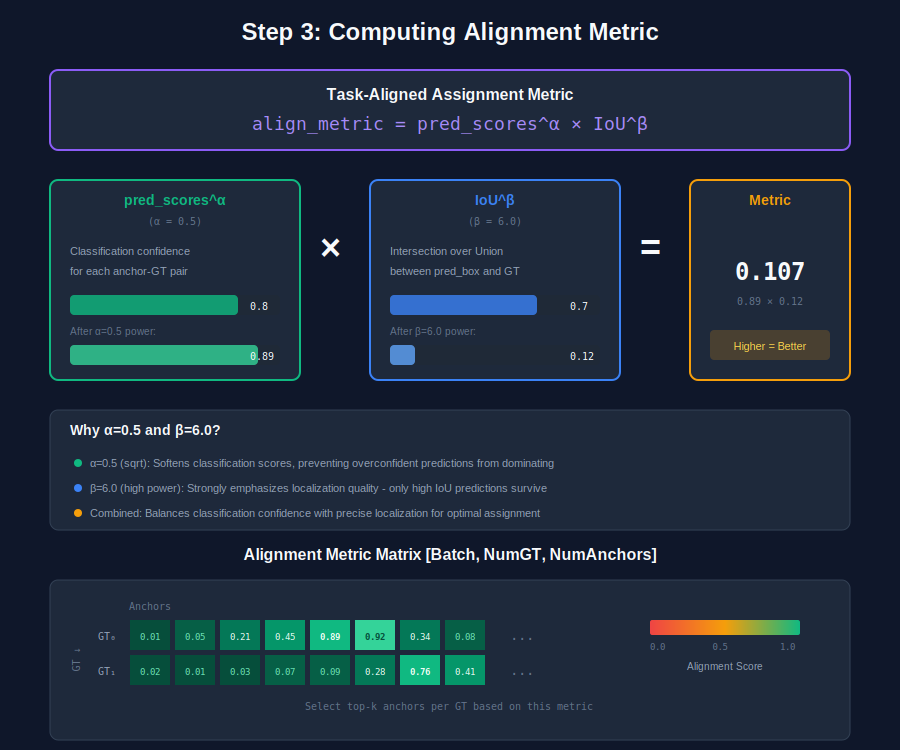
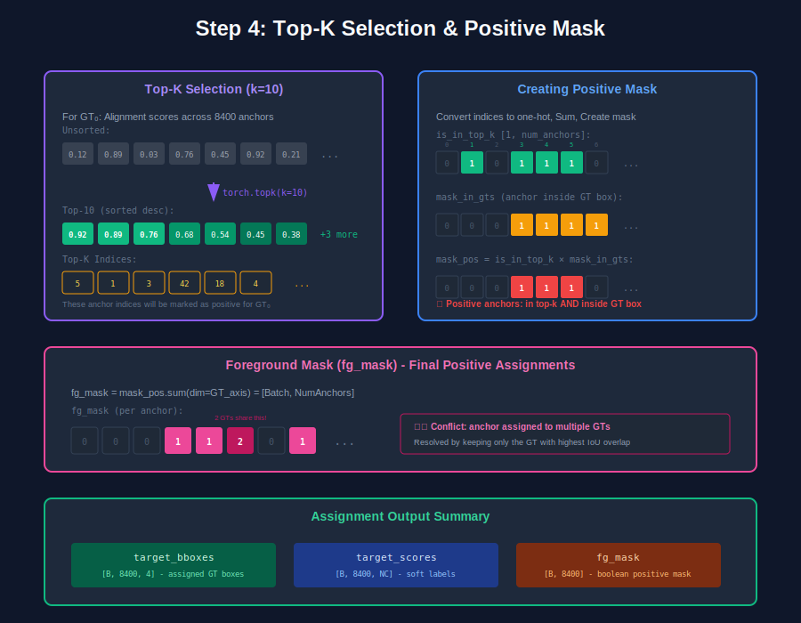
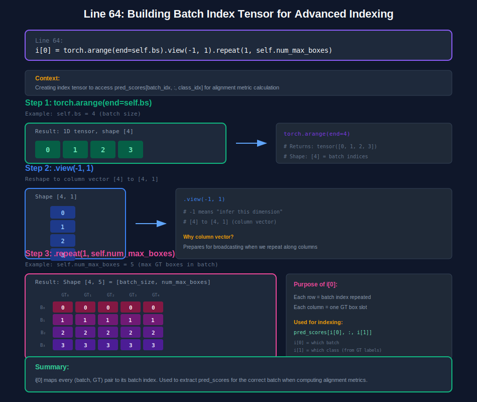
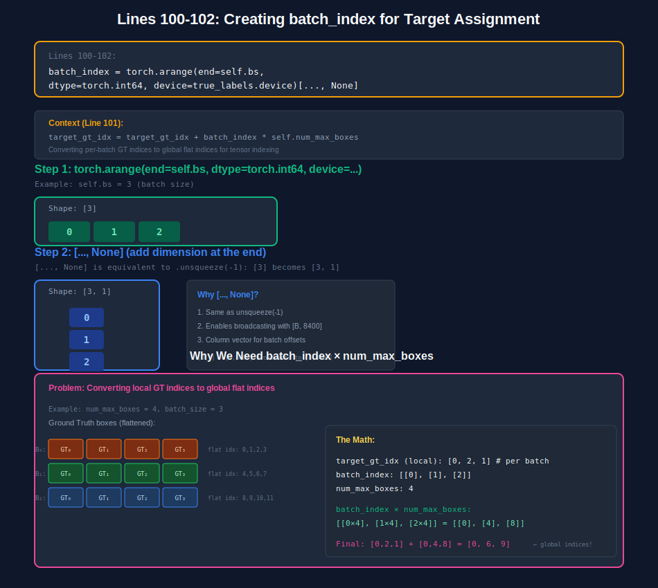
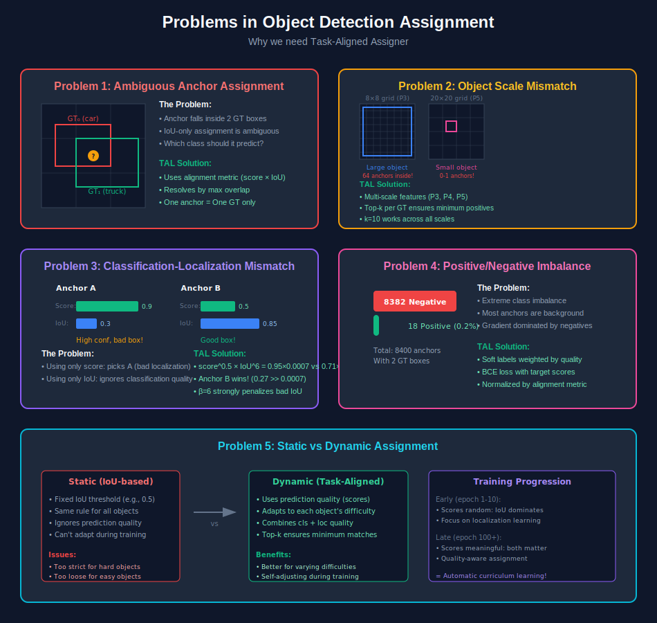
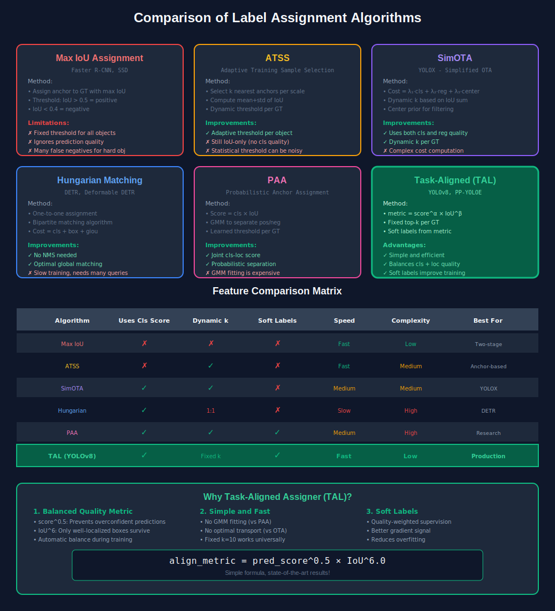
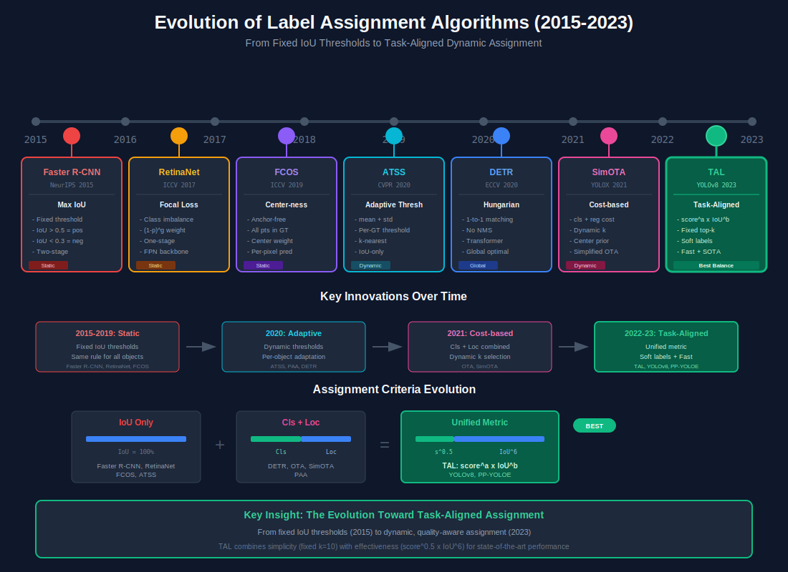

# Task-Aligned Assigner Documentation

This folder contains SVG diagrams and documentation explaining how the Task-Aligned Assigner converts tensors to grid-based assignments for YOLO object detection.

## Class Overview

The `TaskAlignedAssigner` class matches predicted boxes to ground truth boxes using a task-aligned metric that combines classification confidence and localization quality.

```python
from utils.assigner import TaskAlignedAssigner

assigner = TaskAlignedAssigner(
    num_classes=80,    # Number of object classes
    top_k=10,          # Select top-10 anchors per GT
    alpha=0.5,         # Classification score weight (sqrt)
    beta=6.0,          # IoU weight (emphasize localization)
    eps=1e-9           # Numerical stability
)
```

---

## Class Methods

The assigner is divided into 8 well-documented methods for easy understanding:

| Method | Step | Purpose |
|--------|------|---------|
| `_get_empty_targets()` | 0 | Handle case with no GT boxes |
| `_build_batch_indices()` | 1 | Create batch/class index tensors |
| `_compute_alignment_metric()` | 2 | Calculate `score^α × IoU^β` |
| `_get_anchor_in_gt_mask()` | 3 | Check anchors inside GT boxes |
| `_select_topk_candidates()` | 4 | Top-K selection per GT |
| `_resolve_multi_gt_conflicts()` | 5 | Handle anchor → multiple GTs |
| `_get_targets()` | 6 | Extract target boxes & scores |
| `_normalize_scores()` | 7 | Normalize by alignment quality |
| `__call__()` | Main | Orchestrates all steps |

---

## Visual Pipeline Overview

### Complete Assignment Flow



---

## Step-by-Step Process with Diagrams

### Step 1: Input Tensors Structure

Understanding the input tensor shapes and the 8400 anchors breakdown (80×80 + 40×40 + 20×20).



```python
# Input shapes
pred_scores: [Batch, 8400, NumClasses]  # Classification confidence
pred_bboxes: [Batch, 8400, 4]           # Predicted boxes (x1,y1,x2,y2)
true_bboxes: [Batch, MaxGT, 4]          # Ground truth boxes
anchors:     [8400, 2]                   # Grid cell centers (x, y)
```

---

### Step 2: Grid to Anchor Mapping

How 2D feature grid becomes 1D anchor tensor using `make_anchors()`.



```python
def _get_anchor_in_gt_mask(self, true_bboxes, anchors):
    """
    Check which anchor centers fall inside GT boxes.
    
    ┌─────────────────┐
    │     GT Box      │
    │  ●  ●  ●  ●     │  ● = inside (True)
    └─────────────────┘
      ○  ○  ○  ○  ○      ○ = outside (False)
    """
```

---

### Step 3: Computing Alignment Metric

The core formula: `metric = score^α × IoU^β`



```python
def _compute_alignment_metric(self, pred_scores, pred_bboxes, true_bboxes, 
                               batch_indices, iou_fn):
    """
    Compute: metric = score^alpha × IoU^beta
    
    - alpha=0.5: Softens classification scores (sqrt)
    - beta=6.0: Strongly emphasizes localization quality
    """
    class_scores = pred_scores[batch_indices[0], :, batch_indices[1]]
    align_metric = class_scores.pow(self.alpha) * overlaps.pow(self.beta)
```

---

### Step 4: Top-K Selection & Mask Creation

Selecting best k anchors per GT and creating positive assignment masks.



```python
def _select_topk_candidates(self, metrics, true_mask, mask_in_gts):
    """
    Select top-k anchors per GT:
    1. torch.topk() → get best k anchors
    2. one_hot() → convert to binary mask
    3. Filter duplicates & combine masks
    
    mask_pos = is_in_top_k × mask_in_gts × true_mask
    """
```

---

### Step 5: Batch Index Building (Line 64)

Detailed explanation of how batch index tensor is constructed for advanced indexing.



```python
def _build_batch_indices(self, true_labels):
    """
    Build index tensors for pred_scores[i[0], :, i[1]]
    
    i[0] = batch indices repeated for each GT
    i[1] = class indices from GT labels
    """
    # [0,1,2,3] → [[0],[1],[2],[3]] → [[0,0,0],[1,1,1],[2,2,2],[3,3,3]]
    i[0] = torch.arange(end=self.bs).view(-1, 1).repeat(1, self.num_max_boxes)
    i[1] = true_labels.long().squeeze(-1)
```

---

### Step 6: Global Index Calculation (Lines 100-102)

Converting local GT indices to global flat indices for tensor indexing.



```python
def _get_targets(self, mask_pos, fg_mask, true_labels, true_bboxes):
    """
    Convert local → global indices:
    global_idx = local_idx + batch_index × num_max_boxes
    
    Example (num_max_boxes=4):
        Batch 0: local [0,1,2,3] → global [0,1,2,3]
        Batch 1: local [0,1,2,3] → global [4,5,6,7]
        Batch 2: local [0,1,2,3] → global [8,9,10,11]
    """
    batch_index = torch.arange(end=self.bs, dtype=torch.int64, 
                               device=true_labels.device)[..., None]
    target_gt_idx = target_gt_idx + batch_index * self.num_max_boxes
```

---

## Key Concepts

### Multi-Scale Feature Pyramid

```
Input: 640×640 image
       ↓
Scale 1 (P3): 80×80 grid → 6400 anchors (stride=8, small objects)
Scale 2 (P4): 40×40 grid → 1600 anchors (stride=16, medium objects)  
Scale 3 (P5): 20×20 grid →  400 anchors (stride=32, large objects)
       ↓
Total: 8400 anchor positions per image
```

### Alignment Metric Formula

```
align_metric = pred_score^α × IoU^β

Where:
  α = 0.5 (sqrt of score, prevents overconfidence)
  β = 6.0 (high power, only high IoU survives)
```

### Output Tensors

| Tensor | Shape | Description |
|--------|-------|-------------|
| `target_bboxes` | [B, 8400, 4] | Assigned GT box for each anchor |
| `target_scores` | [B, 8400, NC] | Soft classification labels |
| `fg_mask` | [B, 8400] | Boolean mask for positive samples |

---

## Why Task-Aligned Assigner? (Problems & Solutions)

Understanding the problems that TAL solves in object detection assignment.



### Key Problems Solved:

| Problem | Description | TAL Solution |
|---------|-------------|--------------|
| **Ambiguous Assignment** | Anchor inside multiple GT boxes | Resolve by max IoU overlap |
| **Scale Mismatch** | Large objects have too many anchors, small have few | Multi-scale + top-k ensures minimum matches |
| **Quality Mismatch** | High-confidence but poorly localized predictions | Balance with `score^0.5 × IoU^6` |
| **Pos/Neg Imbalance** | ~99.8% anchors are background | Soft labels weighted by quality |
| **Static Thresholds** | Fixed IoU threshold fails for varying difficulty | Dynamic assignment based on predictions |

---

## Algorithm Comparison

How Task-Aligned Assigner compares to other label assignment algorithms.



---

## 📚 Label Assignment Algorithms - Timeline and Papers

### Evolution of Label Assignment (2015-2023)



```
2015 ──── 2017 ──── 2019 ──── 2020 ──── 2021 ──── 2022 ──── 2023
  │         │         │         │         │         │         │
  │         │         │         │         │         │         │
Faster    RetinaNet  FCOS    ATSS      DETR    SimOTA    TAL
R-CNN     Focal     Center   Adaptive  Hungarian OTA    YOLOv8
Max-IoU   Loss      -ness    Threshold Matching  Cost   Task-Aligned
```

---

### 📄 Research Papers with Links

#### 1. Max IoU Assignment (2015)
| | |
|---|---|
| **Paper** | [Faster R-CNN: Towards Real-Time Object Detection with Region Proposal Networks](https://arxiv.org/abs/1506.01497) |
| **Authors** | Shaoqing Ren, Kaiming He, Ross Girshick, Jian Sun |
| **Year** | 2015 (NeurIPS) |
| **Venue** | NeurIPS 2015 |
| **Citations** | 50,000+ |
| **Method** | Fixed IoU threshold (0.5/0.7 for pos, 0.3 for neg) |
| **Key Idea** | Assign anchor to GT with highest IoU if above threshold |

```python
# Max IoU Assignment
positive = IoU(anchor, gt) >= 0.7
negative = IoU(anchor, gt) < 0.3
```

---

#### 2. Focal Loss / RetinaNet (2017)
| | |
|---|---|
| **Paper** | [Focal Loss for Dense Object Detection](https://arxiv.org/abs/1708.02002) |
| **Authors** | Tsung-Yi Lin, Priya Goyal, Ross Girshick, Kaiming He, Piotr Dollar |
| **Year** | 2017 (ICCV) |
| **Venue** | ICCV 2017 (Best Student Paper) |
| **Citations** | 25,000+ |
| **Method** | IoU-based + Focal Loss for class imbalance |
| **Key Idea** | Down-weight easy negatives with `(1-p)^γ` |

```python
# Focal Loss
FL(p) = -alpha * (1 - p)^gamma * log(p)
# gamma = 2.0, alpha = 0.25 typically
```

---

#### 3. FCOS - Center-ness (2019)
| | |
|---|---|
| **Paper** | [FCOS: Fully Convolutional One-Stage Object Detection](https://arxiv.org/abs/1904.01355) |
| **Authors** | Zhi Tian, Chunhua Shen, Hao Chen, Tong He |
| **Year** | 2019 (ICCV) |
| **Venue** | ICCV 2019 |
| **Citations** | 4,000+ |
| **Method** | Anchor-free, center-ness weighting |
| **Key Idea** | All points inside GT are positive, weighted by center-ness |

```python
# Center-ness score
centerness = sqrt((min(l,r) / max(l,r)) * (min(t,b) / max(t,b)))
```

---

#### 4. ATSS - Adaptive Training Sample Selection (2020)
| | |
|---|---|
| **Paper** | [Bridging the Gap Between Anchor-based and Anchor-free Detection](https://arxiv.org/abs/1912.02424) |
| **Authors** | Shifeng Zhang, Cheng Chi, Yongqiang Yao, Zhen Lei, Stan Z. Li |
| **Year** | 2020 (CVPR) |
| **Venue** | CVPR 2020 |
| **Citations** | 1,500+ |
| **Method** | Adaptive IoU threshold per GT using statistics |
| **Key Idea** | Threshold = mean(IoU) + std(IoU) for k-nearest anchors |

```python
# ATSS threshold computation
candidates = select_k_nearest_per_scale(anchors, gt_center, k=9)
threshold = mean(IoU[candidates]) + std(IoU[candidates])
positive = IoU >= threshold AND center_in_gt
```

---

#### 5. DETR - Hungarian Matching (2020)
| | |
|---|---|
| **Paper** | [End-to-End Object Detection with Transformers](https://arxiv.org/abs/2005.12872) |
| **Authors** | Nicolas Carion, Francisco Massa, Gabriel Synnaeve, Nicolas Usunier, Alexander Kirillov, Sergey Zagoruyko |
| **Year** | 2020 (ECCV) |
| **Venue** | ECCV 2020 |
| **Citations** | 8,000+ |
| **Method** | One-to-one bipartite matching with Hungarian algorithm |
| **Key Idea** | Global optimal assignment, no NMS needed |

```python
# Hungarian matching cost
cost = lambda_cls * L_cls + lambda_box * L_box + lambda_giou * L_giou
# Solve assignment using scipy.optimize.linear_sum_assignment
```

---

#### 6. OTA - Optimal Transport Assignment (2021)
| | |
|---|---|
| **Paper** | [OTA: Optimal Transport Assignment for Object Detection](https://arxiv.org/abs/2103.14259) |
| **Authors** | Zheng Ge, Songtao Liu, Zeming Li, Osamu Yoshie, Jian Sun |
| **Year** | 2021 (CVPR) |
| **Venue** | CVPR 2021 |
| **Citations** | 500+ |
| **Method** | Optimal transport for global assignment |
| **Key Idea** | Treat assignment as transportation problem |

```python
# OTA cost matrix
cost = cls_cost + reg_cost + center_cost
# Solve using Sinkhorn-Knopp algorithm
```

---

#### 7. SimOTA - Simplified OTA (2021)
| | |
|---|---|
| **Paper** | [YOLOX: Exceeding YOLO Series in 2021](https://arxiv.org/abs/2107.08430) |
| **Authors** | Zheng Ge, Songtao Liu, Feng Wang, Zeming Li, Jian Sun |
| **Year** | 2021 |
| **Venue** | arXiv (Megvii) |
| **Citations** | 3,000+ |
| **Method** | Simplified OTA with dynamic k |
| **Key Idea** | Dynamic k based on IoU sum, no Sinkhorn iteration |

```python
# SimOTA
cost = cls_cost + 3.0 * reg_cost
dynamic_k = max(1, int(sum(IoU[inside_gt])))
topk_indices = topk(cost, k=dynamic_k)
```

---

#### 8. PAA - Probabilistic Anchor Assignment (2020)
| | |
|---|---|
| **Paper** | [Probabilistic Anchor Assignment with IoU Prediction for Object Detection](https://arxiv.org/abs/2007.08103) |
| **Authors** | Kang Kim, Hee Seok Lee |
| **Year** | 2020 (ECCV) |
| **Venue** | ECCV 2020 |
| **Citations** | 400+ |
| **Method** | GMM-based separation of positives and negatives |
| **Key Idea** | Score = cls_score × IoU, fit GMM to separate |

```python
# PAA score and GMM
score = cls_score * IoU
gmm = GaussianMixture(n_components=2)
gmm.fit(scores)
positive = gmm.predict(scores) == positive_component
```

---

#### 9. Task-Aligned Assigner - TAL (2022-2023)
| | |
|---|---|
| **Paper** | [TOOD: Task-aligned One-stage Object Detection](https://arxiv.org/abs/2108.07755) |
| **Authors** | Chengjian Feng, Yujie Zhong, Yu Gao, Matthew R. Scott, Weilin Huang |
| **Year** | 2021 (ICCV) |
| **Venue** | ICCV 2021 |
| **Also Used In** | [PP-YOLOE](https://arxiv.org/abs/2203.16250) (2022), YOLOv8 (2023) |
| **Citations** | 400+ |
| **Method** | Task-aligned metric with soft labels |
| **Key Idea** | `metric = score^α × IoU^β`, fixed top-k |

```python
# Task-Aligned Assignment
align_metric = pred_score ** 0.5 * IoU ** 6.0
positive = topk(align_metric, k=10) AND inside_gt
target_score = normalize(align_metric)  # Soft labels
```

---

### 📊 Comprehensive Comparison Table

| Algorithm | Year | Paper | Venue | Assignment Type | Uses Cls | Uses Loc | Dynamic | NMS | Speed |
|-----------|------|-------|-------|-----------------|----------|----------|---------|-----|-------|
| **Max IoU** | 2015 | [Faster R-CNN](https://arxiv.org/abs/1506.01497) | NeurIPS | IoU threshold | ✗ | ✓ | ✗ | ✓ | ⚡ Fast |
| **Focal** | 2017 | [RetinaNet](https://arxiv.org/abs/1708.02002) | ICCV | IoU + Focal Loss | ✗ | ✓ | ✗ | ✓ | ⚡ Fast |
| **FCOS** | 2019 | [FCOS](https://arxiv.org/abs/1904.01355) | ICCV | Center-ness | ✗ | ✓ | ✗ | ✓ | ⚡ Fast |
| **ATSS** | 2020 | [ATSS](https://arxiv.org/abs/1912.02424) | CVPR | Adaptive threshold | ✗ | ✓ | ✓ | ✓ | ⚡ Fast |
| **DETR** | 2020 | [DETR](https://arxiv.org/abs/2005.12872) | ECCV | Hungarian 1:1 | ✓ | ✓ | ✗ | ✗ | 🐢 Slow |
| **PAA** | 2020 | [PAA](https://arxiv.org/abs/2007.08103) | ECCV | GMM separation | ✓ | ✓ | ✓ | ✓ | 🚶 Medium |
| **OTA** | 2021 | [OTA](https://arxiv.org/abs/2103.14259) | CVPR | Optimal Transport | ✓ | ✓ | ✓ | ✓ | 🐢 Slow |
| **SimOTA** | 2021 | [YOLOX](https://arxiv.org/abs/2107.08430) | arXiv | Simplified OTA | ✓ | ✓ | ✓ | ✓ | 🚶 Medium |
| **TAL** | 2021 | [TOOD](https://arxiv.org/abs/2108.07755) | ICCV | Task-aligned | ✓ | ✓ | Fixed k | ✓ | ⚡ Fast |

---

### 🏆 Performance Comparison (COCO val2017)

| Method | Backbone | AP | AP50 | AP75 | APs | APm | APl |
|--------|----------|-----|------|------|-----|-----|-----|
| RetinaNet | ResNet-50 | 36.5 | 55.4 | 39.1 | 20.4 | 40.3 | 48.1 |
| FCOS | ResNet-50 | 38.7 | 57.4 | 41.8 | 22.9 | 42.5 | 50.1 |
| ATSS | ResNet-50 | 39.4 | 57.6 | 42.8 | 23.6 | 42.9 | 50.3 |
| PAA | ResNet-50 | 40.4 | 58.4 | 43.9 | 24.0 | 44.2 | 51.7 |
| OTA | ResNet-50 | 40.7 | 58.4 | 44.3 | 23.2 | 45.0 | 53.6 |
| **TOOD (TAL)** | ResNet-50 | **42.5** | **59.9** | **46.2** | **25.6** | **45.8** | **55.1** |

---

### Why TAL Wins:
- **Simple**: Just `score^0.5 × IoU^6` 
- **Fast**: No GMM fitting or optimal transport
- **Effective**: Soft labels improve training
- **Robust**: Fixed k=10 works universally
- **State-of-the-art**: Best AP with same backbone

---

## SVG Diagrams Index

### Core Pipeline Diagrams

| # | File | Description |
|---|------|-------------|
| 1 | [01_input_tensors.svg](./01_input_tensors.svg) | Input tensor shapes & 8400 anchors |
| 2 | [02_grid_anchor_mapping.svg](./02_grid_anchor_mapping.svg) | Grid → 1D tensor mapping |
| 3 | [03_alignment_metric.svg](./03_alignment_metric.svg) | `score^α × IoU^β` formula |
| 4 | [04_topk_selection.svg](./04_topk_selection.svg) | Top-K & mask creation |
| 5 | [05_complete_flow.svg](./05_complete_flow.svg) | End-to-end pipeline |

### Detailed Operation Diagrams

| # | File | Description |
|---|------|-------------|
| 6 | [06_batch_indexing_line64.svg](./06_batch_indexing_line64.svg) | `_build_batch_indices()` |
| 7 | [07_batch_index_line100.svg](./07_batch_index_line100.svg) | Global index calculation |

### Problem & Comparison Diagrams

| # | File | Description |
|---|------|-------------|
| 8 | [08_assignment_problems.svg](./08_assignment_problems.svg) | Problems TAL solves |
| 9 | [09_assigner_comparison.svg](./09_assigner_comparison.svg) | Algorithm comparison matrix |
| 10 | [10_algorithm_timeline.svg](./10_algorithm_timeline.svg) | Evolution timeline (2015-2023) |

---

## Usage Example

```python
from utils.assigner import TaskAlignedAssigner

# Initialize
assigner = TaskAlignedAssigner(num_classes=80)

# During training forward pass
target_bboxes, target_scores, fg_mask = assigner(
    pred_scores,      # [B, 8400, 80]
    pred_bboxes,      # [B, 8400, 4]
    gt_labels,        # [B, N, 1]
    gt_bboxes,        # [B, N, 4]
    gt_mask,          # [B, N, 1]
    anchor_points,    # [8400, 2]
    iou_fn            # CIoU function
)

# Use for loss computation
cls_loss = bce_loss(pred_scores[fg_mask], target_scores[fg_mask])
box_loss = ciou_loss(pred_bboxes[fg_mask], target_bboxes[fg_mask])
```

---

## Viewing Diagrams

**In GitHub/GitLab:** SVG images render automatically inline.

**Locally:** Open any `.svg` file in:
- Web browser (Chrome, Firefox, Safari)
- VS Code with SVG preview extension
- Vector graphics editor (Inkscape, Illustrator)

All diagrams use a dark theme with syntax highlighting.

---

## 📚 Navigation

| Previous | Up | Next |
|:---------|:--:|-----:|
| [← Utils Package](../../README.md) | [🏠 Utils](../../README.md) | [BBox →](../../bbox/docs/README.md) |
