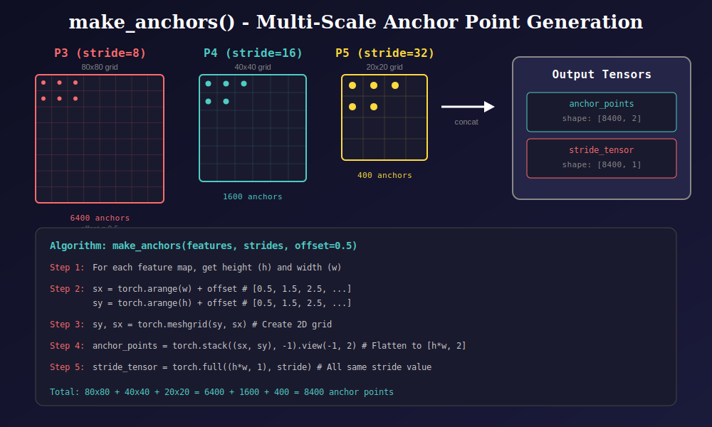
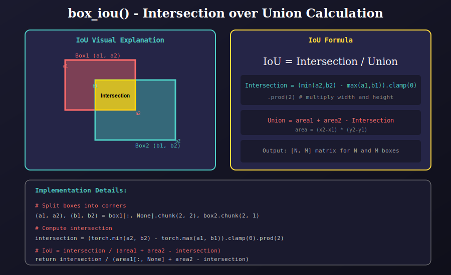
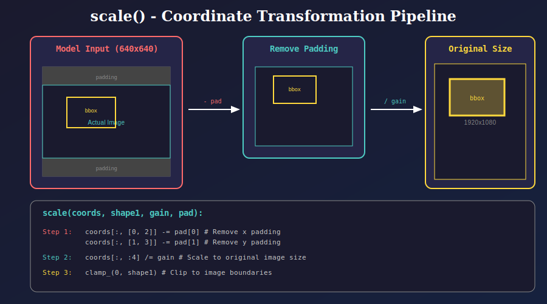

# Bounding Box Operations (`bbox.py`)

This module provides essential bounding box operations for object detection, including coordinate conversion, IoU calculation, anchor generation, and Non-Maximum Suppression.

---

## 📊 Visual Overview

### 1. Coordinate Format Conversion

YOLOv8 uses center-based coordinates internally and converts to corner-based for IoU calculations.


**Function: `wh2xy(x)`**

Converts bounding boxes from CXCYWH (center-x, center-y, width, height) to XYXY (x1, y1, x2, y2) format.

```python
def wh2xy(x):
    y = x.clone()
    y[..., 0] = x[..., 0] - x[..., 2] / 2  # x1 = cx - w/2
    y[..., 1] = x[..., 1] - x[..., 3] / 2  # y1 = cy - h/2
    y[..., 2] = x[..., 0] + x[..., 2] / 2  # x2 = cx + w/2
    y[..., 3] = x[..., 1] + x[..., 3] / 2  # y2 = cy + h/2
    return y
```

| Input | Output |
|-------|--------|
| `[cx, cy, w, h]` | `[x1, y1, x2, y2]` |
| `[100, 100, 50, 40]` | `[75, 80, 125, 120]` |

---

### 2. Multi-Scale Anchor Generation

YOLOv8 generates anchor points across multiple feature pyramid levels.



**Function: `make_anchors(features, strides, offset=0.5)`**

Generates anchor points for all feature map scales.

```python
def make_anchors(x, strides, offset=0.5):
    anchor_points, stride_tensor = [], []
    for i, stride in enumerate(strides):
        _, _, h, w = x[i].shape
        # Create grid coordinates with 0.5 offset (cell centers)
        sx = torch.arange(end=w) + offset  # [0.5, 1.5, 2.5, ...]
        sy = torch.arange(end=h) + offset
        sy, sx = torch.meshgrid(sy, sx)
        anchor_points.append(torch.stack((sx, sy), -1).view(-1, 2))
        stride_tensor.append(torch.full((h * w, 1), stride))
    return torch.cat(anchor_points), torch.cat(stride_tensor)
```

**Feature Pyramid Network (FPN) Scales:**

| Level | Stride | Grid Size | Anchors | Object Size |
|-------|--------|-----------|---------|-------------|
| P3 | 8 | 80×80 | 6,400 | Small |
| P4 | 16 | 40×40 | 1,600 | Medium |
| P5 | 32 | 20×20 | 400 | Large |
| **Total** | - | - | **8,400** | - |

---

### 3. IoU Calculation

Intersection over Union measures the overlap between predicted and ground truth boxes.



**Function: `box_iou(box1, box2)`**

Computes pairwise IoU between two sets of boxes.

```python
def box_iou(box1, box2):
    # box1: [N, 4], box2: [M, 4]
    # Returns: [N, M] IoU matrix
    
    # Split into corners
    (a1, a2), (b1, b2) = box1[:, None].chunk(2, 2), box2.chunk(2, 1)
    
    # Intersection area
    intersection = (torch.min(a2, b2) - torch.max(a1, b1)).clamp(0).prod(2)
    
    # Individual areas
    area1 = (box1[:, 2] - box1[:, 0]) * (box1[:, 3] - box1[:, 1])
    area2 = (box2[:, 2] - box2[:, 0]) * (box2[:, 3] - box2[:, 1])
    
    # IoU = intersection / union
    return intersection / (area1[:, None] + area2 - intersection)
```

**IoU Formula:**

$$IoU = \frac{|A \cap B|}{|A \cup B|} = \frac{Intersection}{Area_A + Area_B - Intersection}$$

---

### 4. Non-Maximum Suppression (NMS)

NMS removes redundant overlapping detections, keeping only the best ones.


**Function: `non_max_suppression(prediction, conf_threshold=0.25, iou_threshold=0.45)`**

Performs batched NMS on model predictions.

**Algorithm Pipeline:**

1. **Confidence Filter**: Remove boxes with max class score < 0.25
2. **Format Conversion**: Convert CXCYWH to XYXY using `wh2xy()`
3. **Sort by Score**: Rank detections by confidence (descending)
4. **Class Offset**: Add `class_id * max_wh` to prevent cross-class suppression
5. **Apply NMS**: Use `torchvision.ops.nms()` with IoU threshold 0.45
6. **Limit Output**: Keep at most 300 detections per image

**Key Parameters:**

| Parameter | Value | Description |
|-----------|-------|-------------|
| `conf_threshold` | 0.25 | Minimum confidence score |
| `iou_threshold` | 0.45 | NMS IoU threshold |
| `max_det` | 300 | Maximum detections per image |
| `max_nms` | 30,000 | Maximum boxes into NMS |
| `max_wh` | 7,680 | Max box dimension (for class offset) |

**Output Format:**

```
[x1, y1, x2, y2, confidence, class_id]
```

---

### 5. Coordinate Scaling

Transforms detection coordinates from model input space to original image space.



**Function: `scale(coords, shape1, gain, pad)`**

Reverses letterbox preprocessing to get coordinates in original image space.

```python
def scale(coords, shape1, gain, pad):
    # Step 1: Remove padding
    coords[:, [0, 2]] -= pad[0]  # x coordinates
    coords[:, [1, 3]] -= pad[1]  # y coordinates
    
    # Step 2: Scale to original size
    coords[:, :4] /= gain
    
    # Step 3: Clip to image boundaries
    coords[:, 0].clamp_(0, shape1[1])  # x1
    coords[:, 1].clamp_(0, shape1[0])  # y1
    coords[:, 2].clamp_(0, shape1[1])  # x2
    coords[:, 3].clamp_(0, shape1[0])  # y2
    return coords
```

**Letterbox Preprocessing:**

When an image is preprocessed:
1. Original image (e.g., 1920×1080) is resized while maintaining aspect ratio
2. Padding is added to reach model input size (640×640)
3. `scale()` reverses this to get original coordinates

---

## 📁 Module Structure

```
utils/
├── bbox.py                 # Main module
└── bbox/
    └── docs/
        ├── README.md       # This documentation
        ├── 01_coordinate_formats.svg
        ├── 02_anchor_generation.svg
        ├── 03_iou_calculation.svg
        ├── 04_nms_algorithm.svg
        └── 05_scale_coordinates.svg
```

---

## 🔗 Dependencies

- `torch` - Tensor operations
- `torchvision` - NMS implementation (`torchvision.ops.nms`)
- `time` - NMS timeout handling

---

## 📚 References

1. **Non-Maximum Suppression**: Neubeck & Van Gool, "Efficient Non-Maximum Suppression" (2006)
2. **Feature Pyramid Networks**: Lin et al., "Feature Pyramid Networks for Object Detection" (2017)
3. **YOLOv8**: Ultralytics (2023) - https://github.com/ultralytics/ultralytics

---

## 🎯 Usage Example

```python
from utils.bbox import make_anchors, box_iou, wh2xy, non_max_suppression, scale

# Generate anchors for feature maps
features = [p3, p4, p5]  # Feature pyramid outputs
strides = [8, 16, 32]
anchors, strides_tensor = make_anchors(features, strides)

# Convert predictions
boxes_xyxy = wh2xy(boxes_cxcywh)

# Calculate IoU
iou_matrix = box_iou(pred_boxes, gt_boxes)

# Apply NMS
detections = non_max_suppression(model_output)

# Scale to original image
scaled_detections = scale(detections, original_shape, gain, pad)
```

---

## 📚 Navigation

| Previous | Up | Next |
|:---------|:--:|-----:|
| [← Assigner](../../assigner/docs/README.md) | [🏠 Utils](../../README.md) | [Loss →](../../loss/docs/README.md) |

