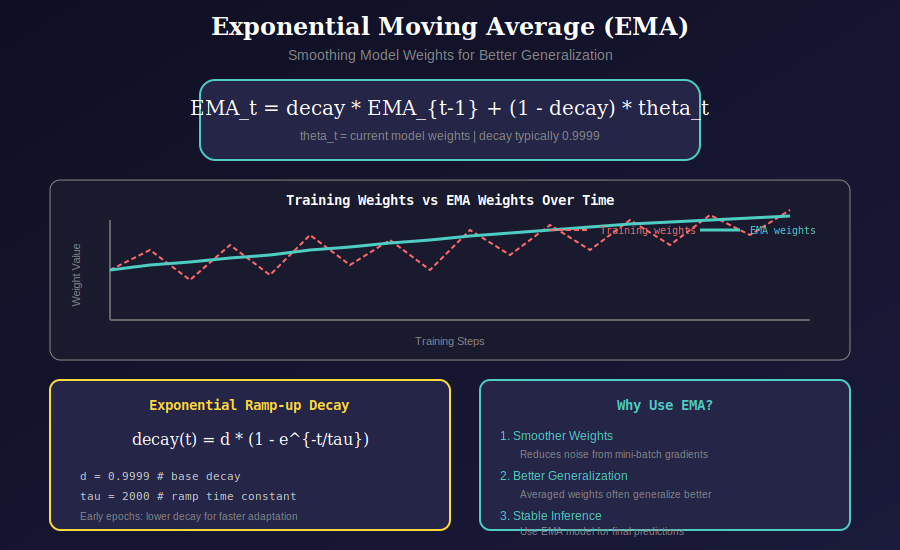
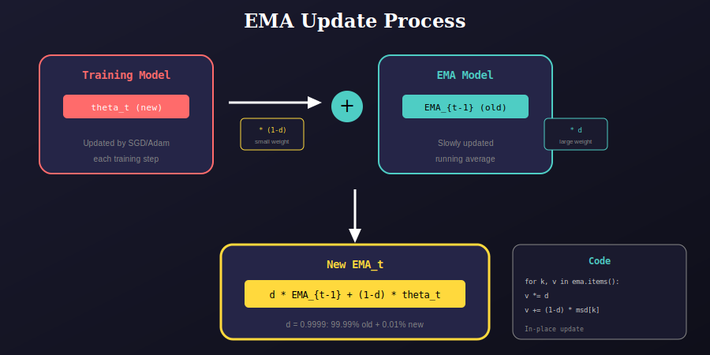

# Exponential Moving Average (`ema.py`)

This module implements Exponential Moving Average (EMA) for model weights, a technique that improves model generalization by maintaining a smoothed version of the training weights.

---

## 📊 Visual Overview

### 1. EMA Concept

EMA maintains a running average of model weights that changes slowly over training.



**Key Formula:**

$$EMA_t = decay \cdot EMA_{t-1} + (1 - decay) \cdot \theta_t$$

Where:
- `EMA_t`: EMA weights at step t
- `θ_t`: Training model weights at step t
- `decay`: Smoothing factor (typically 0.9999)

**Ramp-up Decay:**

$$decay(t) = d \cdot (1 - e^{-t/\tau})$$

- `d = 0.9999`: Base decay rate
- `τ = 2000`: Time constant for ramp-up

---

### 2. EMA Update Process



Each training step:
1. Training model is updated via optimizer
2. EMA model is updated with weighted average
3. 99.99% of old EMA + 0.01% of new weights

---

## 🔧 Class: `EMA`

### Constructor

```python
def __init__(self, model, decay=0.9999, tau=2000, updates=0):
    """
    Initialize EMA.
    
    Args:
        model: PyTorch model to track
        decay: Base decay rate (default: 0.9999)
        tau: Decay ramp-up time constant (default: 2000)
        updates: Initial update count (default: 0)
    """
    self.ema = copy.deepcopy(model).eval()  # FP32 copy
    self.updates = updates
    self.decay = lambda x: decay * (1 - math.exp(-x / tau))
    
    # Disable gradients for EMA model
    for p in self.ema.parameters():
        p.requires_grad_(False)
```

### Update Method

```python
def update(self, model):
    """
    Update EMA parameters.
    
    Args:
        model: Current training model
    """
    with torch.no_grad():
        self.updates += 1
        d = self.decay(self.updates)
        
        msd = model.state_dict()
        for k, v in self.ema.state_dict().items():
            if v.dtype.is_floating_point:
                v *= d
                v += (1 - d) * msd[k].detach()
```

---

## 📁 Module Structure

```
utils/
├── ema.py                   # Main module
└── ema/
    └── docs/
        ├── README.md        # This documentation
        ├── 01_ema_concept.svg
        └── 02_ema_update.svg
```

---

## 💡 Why Use EMA?

| Benefit | Description |
|---------|-------------|
| **Noise Reduction** | Smooths out mini-batch gradient noise |
| **Better Generalization** | Averaged weights often perform better on test data |
| **Stable Inference** | Use EMA model for final predictions |
| **Free Ensemble** | Effectively an ensemble of past model states |

---

## 📊 Decay Schedule

| Step | Effective Decay | % Old EMA | % New Weights |
|------|-----------------|-----------|---------------|
| 1 | 0.0005 | 0.05% | 99.95% |
| 100 | 0.0488 | 4.88% | 95.12% |
| 1000 | 0.3935 | 39.35% | 60.65% |
| 2000 | 0.6321 | 63.21% | 36.79% |
| 10000 | 0.9933 | 99.33% | 0.67% |
| ∞ | 0.9999 | 99.99% | 0.01% |

---

## 📚 References

1. **EMA in Deep Learning**: Polyak & Juditsky, "Acceleration of Stochastic Approximation by Averaging" (1992)

2. **TensorFlow EMA**: https://www.tensorflow.org/api_docs/python/tf/train/ExponentialMovingAverage

3. **timm Implementation**: https://github.com/rwightman/pytorch-image-models

---

## 🎯 Usage Example

```python
from utils.ema import EMA

# Initialize EMA
ema = EMA(model, decay=0.9999, tau=2000)

# Training loop
for epoch in range(epochs):
    for images, targets in dataloader:
        # Forward pass
        outputs = model(images)
        loss = criterion(outputs, targets)
        
        # Backward pass
        optimizer.zero_grad()
        loss.backward()
        optimizer.step()
        
        # Update EMA after each step
        ema.update(model)

# Use EMA model for inference
ema.ema.eval()
predictions = ema.ema(test_images)
```

---

## ⚠️ Important Notes

1. **Memory**: EMA maintains a full copy of the model (doubles memory for weights)

2. **FP32 Precision**: EMA is stored in FP32 even if training uses mixed precision

3. **No Gradients**: EMA parameters have `requires_grad=False`

4. **State Dict**: Both parameters and buffers are tracked (batch norm running stats, etc.)

---

## 📚 Navigation

| Previous | Up | Next |
|:---------|:--:|-----:|
| [← Loss](../../loss/docs/README.md) | [🏠 Utils](../../README.md) | [Metrics →](../../metrics/docs/README.md) |

