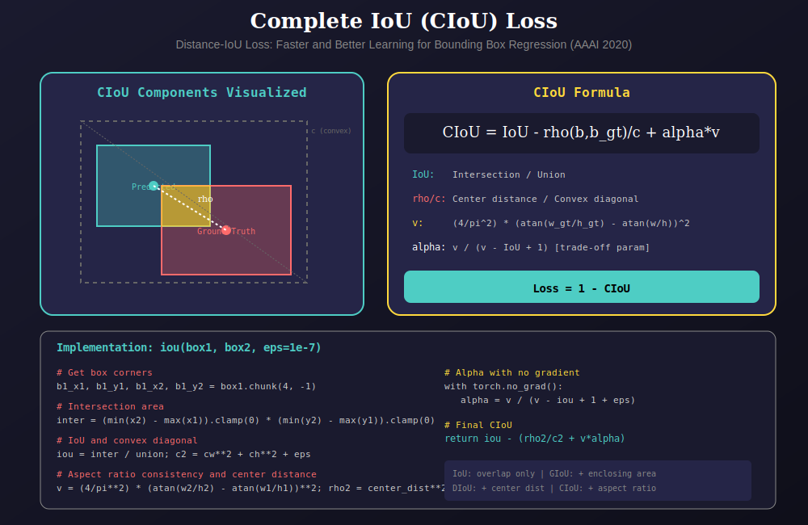
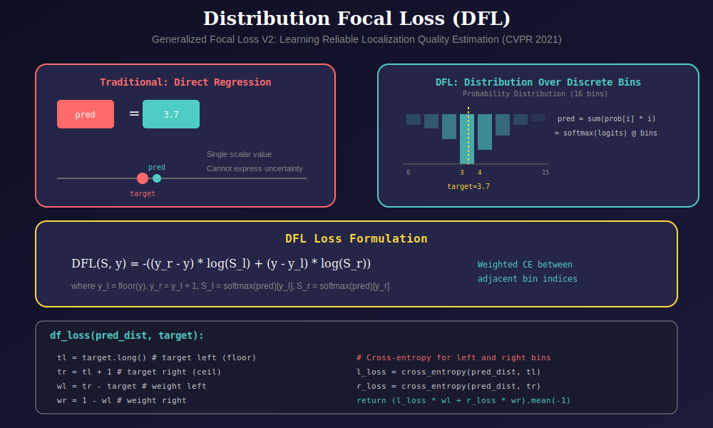
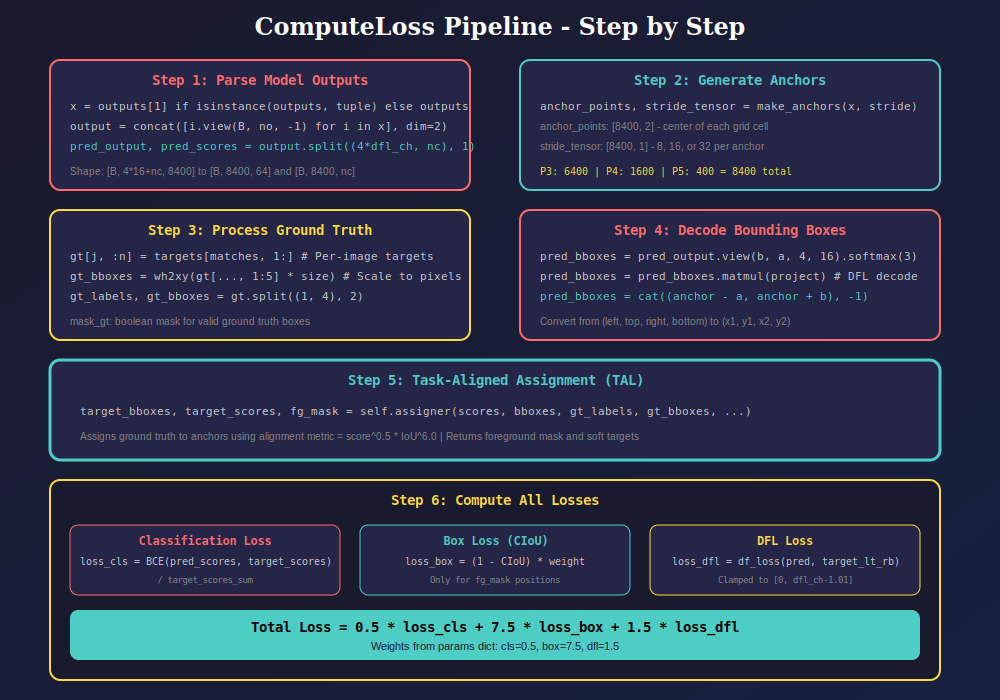

# Loss Computation Module (`loss.py`)

This module implements the YOLOv8 loss function, combining classification, bounding box regression (CIoU), and Distribution Focal Loss (DFL).

---

## 📊 Visual Overview

### 1. Loss Function Overview

YOLOv8 uses a multi-task loss combining three components:


**Total Loss Formula:**

$$L_{total} = \lambda_{cls} \cdot L_{cls} + \lambda_{box} \cdot L_{box} + \lambda_{dfl} \cdot L_{dfl}$$

| Component | Loss Type | Weight | Purpose |
|-----------|-----------|--------|---------|
| `L_cls` | BCE with Logits | 0.5 | Multi-label classification |
| `L_box` | 1 - CIoU | 7.5 | Box regression |
| `L_dfl` | Distribution Focal | 1.5 | Localization quality |

---

### 2. Complete IoU (CIoU) Loss

CIoU improves upon IoU by considering distance, overlap, and aspect ratio.



**CIoU Formula:**

$$CIoU = IoU - \frac{\rho^2(b, b^{gt})}{c^2} - \alpha v$$

Where:
- `IoU`: Standard Intersection over Union
- `ρ(b, b^gt)`: Euclidean distance between box centers
- `c`: Diagonal length of smallest enclosing box
- `v`: Aspect ratio consistency term
- `α`: Trade-off parameter (computed dynamically)

**Aspect Ratio Term:**

$$v = \frac{4}{\pi^2} \left( \arctan\frac{w^{gt}}{h^{gt}} - \arctan\frac{w}{h} \right)^2$$

**Trade-off Parameter:**

$$\alpha = \frac{v}{(1 - IoU) + v}$$

**Evolution of IoU Losses:**

| Loss | Year | Considers |
|------|------|-----------|
| IoU | - | Overlap only |
| GIoU | 2019 | + Enclosing area |
| DIoU | 2020 | + Center distance |
| CIoU | 2020 | + Aspect ratio |

---

### 3. Distribution Focal Loss (DFL)

DFL represents bounding box regression as a probability distribution over discrete bins.



**Key Innovation:**

Instead of directly regressing a continuous value, DFL:
1. Discretizes the target into bins (default: 16 bins)
2. Predicts a probability distribution over bins
3. Computes the expected value as the final prediction

**DFL Formula:**

$$DFL(S, y) = -\left((y_r - y) \log(S_l) + (y - y_l) \log(S_r)\right)$$

Where:
- `y`: Target value (e.g., 3.7)
- `y_l = floor(y)` (e.g., 3)
- `y_r = y_l + 1` (e.g., 4)
- `S_l, S_r`: Softmax probabilities at indices l and r

**Benefits:**
- Captures uncertainty in localization
- More stable training for ambiguous boundaries
- Better generalization to unseen object sizes

---

### 4. Loss Computation Pipeline

The complete forward pass of loss computation:



**Pipeline Steps:**

1. **Parse Outputs**: Split model output into box predictions and class scores
2. **Generate Anchors**: Create anchor points for all FPN levels
3. **Process Targets**: Convert ground truth to per-image format
4. **Decode Boxes**: Convert DFL outputs to bounding boxes
5. **TAL Assignment**: Match predictions to ground truth
6. **Compute Losses**: Calculate cls, box, and dfl losses

---

## 📁 Module Structure

```
utils/
├── loss.py                  # Main module
└── loss/
    └── docs/
        ├── README.md        # This documentation
        ├── 01_loss_overview.svg
        ├── 02_ciou_loss.svg
        ├── 03_dfl_loss.svg
        └── 04_loss_pipeline.svg
```

---

## 🔧 Class: `ComputeLoss`

### Constructor

```python
def __init__(self, model, params):
    """
    Initialize loss computation.
    
    Args:
        model: YOLO model (extracts head configuration)
        params: Dict with 'cls', 'box', 'dfl' weight keys
    """
```

### Forward Call

```python
def __call__(self, outputs, targets):
    """
    Compute total loss.
    
    Args:
        outputs: Model predictions [B, 4*dfl_ch+nc, 8400]
        targets: Ground truth [N, 6] (img_idx, cls, cx, cy, w, h)
    
    Returns:
        Total weighted loss (scalar tensor)
    """
```

### Static Methods

| Method | Description |
|--------|-------------|
| `df_loss(pred_dist, target)` | Distribution Focal Loss between bins |
| `iou(box1, box2, eps)` | Complete IoU computation |

---

## 📚 References

1. **CIoU Loss**: Zheng et al., "Distance-IoU Loss: Faster and Better Learning for Bounding Box Regression" (AAAI 2020)
   - Paper: https://arxiv.org/abs/1911.08287

2. **DFL**: Li et al., "Generalized Focal Loss: Learning Qualified and Distributed Bounding Boxes for Dense Object Detection" (NeurIPS 2020)
   - Paper: https://arxiv.org/abs/2006.04388

3. **GFL V2**: Li et al., "Generalized Focal Loss V2: Learning Reliable Localization Quality Estimation for Dense Object Detection" (CVPR 2021)
   - Paper: https://arxiv.org/abs/2011.12885

4. **YOLOv8**: Ultralytics (2023)
   - Repository: https://github.com/ultralytics/ultralytics

---

## 🎯 Usage Example

```python
from utils.loss import ComputeLoss

# Initialize loss function
params = {'cls': 0.5, 'box': 7.5, 'dfl': 1.5}
loss_fn = ComputeLoss(model, params)

# Training loop
for images, targets in dataloader:
    outputs = model(images)
    loss = loss_fn(outputs, targets)
    loss.backward()
    optimizer.step()
```

---

## ⚙️ Key Parameters

| Parameter | Default | Description |
|-----------|---------|-------------|
| `top_k` | 10 | Top-k candidates per GT in TAL |
| `alpha` | 0.5 | Classification score weight in alignment |
| `beta` | 6.0 | IoU weight in alignment metric |
| `dfl_ch` | 16 | Number of DFL distribution bins |

---

## 💡 Implementation Notes

1. **Gradient Flow**: `alpha` in CIoU is computed with `torch.no_grad()` to prevent unstable gradients

2. **DFL Clamping**: Target distances are clamped to `[0, dfl_ch - 1.01]` to stay within valid bin range

3. **Normalization**: All losses are normalized by `target_scores_sum` for consistent gradient magnitudes

4. **Foreground Focus**: Box and DFL losses are only computed for foreground (assigned) anchors via `fg_mask`

---

## 📚 Navigation

| Previous | Up | Next |
|:---------|:--:|-----:|
| [← BBox](../../bbox/docs/README.md) | [🏠 Utils](../../README.md) | [EMA →](../../ema/docs/README.md) |

