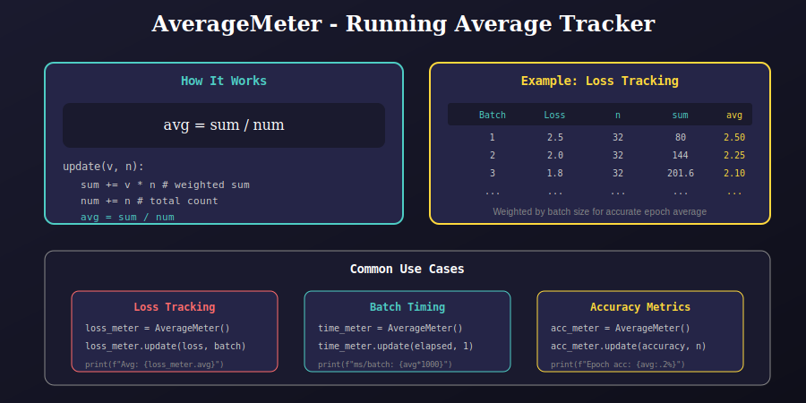

# Training Meters Module (`meters.py`)

This module provides utility classes for tracking running averages during training, such as loss, accuracy, and timing statistics.

---

## 📊 Visual Overview

### AverageMeter Concept



---

## 🔧 Class: `AverageMeter`

A simple class to compute and store running averages, weighted by sample count.

### Constructor

```python
def __init__(self):
    """Initialize the meter with zero values."""
    self.num = 0    # Total count
    self.sum = 0    # Running sum
    self.avg = 0    # Current average
```

### Update Method

```python
def update(self, v, n):
    """
    Update the meter with a new value.
    
    Args:
        v: Value to add (e.g., batch loss)
        n: Number of samples (e.g., batch size)
    
    Note:
        Ignores NaN values for robustness
    """
    if not math.isnan(float(v)):
        self.num = self.num + n
        self.sum = self.sum + v * n
        self.avg = self.sum / self.num
```

---

## 📁 Module Structure

```
utils/
├── meters.py                # Main module
└── meters/
    └── docs/
        ├── README.md        # This documentation
        └── 01_average_meter.svg
```

---

## 💡 Why Use AverageMeter?

### Problem: Batch Size Varies

When computing epoch averages, simple averaging is wrong if batch sizes differ:

```python
# WRONG: Simple average (ignores batch size)
losses = [2.5, 2.0, 1.8, 1.5]  # Last batch might be smaller!
avg = sum(losses) / len(losses)  # Biased average

# CORRECT: Weighted average
meter = AverageMeter()
meter.update(2.5, 32)  # Full batch
meter.update(2.0, 32)
meter.update(1.8, 32)
meter.update(1.5, 16)  # Last batch smaller
print(meter.avg)  # Correct weighted average
```

### NaN Handling

```python
meter = AverageMeter()
meter.update(float('nan'), 32)  # Ignored!
meter.update(1.5, 32)           # Only this is counted
print(meter.avg)  # 1.5, not NaN
```

---

## 📊 Attributes

| Attribute | Type | Description |
|-----------|------|-------------|
| `num` | int | Total number of samples |
| `sum` | float | Weighted sum of all values |
| `avg` | float | Current running average |

---

## 🎯 Usage Examples

### 1. Loss Tracking

```python
from utils.meters import AverageMeter

loss_meter = AverageMeter()

for epoch in range(epochs):
    loss_meter = AverageMeter()  # Reset each epoch
    
    for batch_idx, (images, targets) in enumerate(train_loader):
        outputs = model(images)
        loss = criterion(outputs, targets)
        
        # Update meter with batch loss
        loss_meter.update(loss.item(), images.size(0))
        
        # Logging
        if batch_idx % 100 == 0:
            print(f"Batch {batch_idx}: Loss = {loss.item():.4f}")
    
    print(f"Epoch {epoch}: Avg Loss = {loss_meter.avg:.4f}")
```

### 2. Multiple Metrics

```python
loss_meter = AverageMeter()
acc_meter = AverageMeter()
time_meter = AverageMeter()

for batch in train_loader:
    start = time.time()
    
    loss, accuracy = train_step(batch)
    
    elapsed = time.time() - start
    batch_size = batch[0].size(0)
    
    loss_meter.update(loss, batch_size)
    acc_meter.update(accuracy, batch_size)
    time_meter.update(elapsed, 1)

print(f"Loss: {loss_meter.avg:.4f}")
print(f"Accuracy: {acc_meter.avg:.2%}")
print(f"Time/batch: {time_meter.avg*1000:.1f}ms")
```

### 3. Validation Metrics

```python
def validate(model, val_loader):
    model.eval()
    loss_meter = AverageMeter()
    
    with torch.no_grad():
        for images, targets in val_loader:
            outputs = model(images)
            loss = criterion(outputs, targets)
            loss_meter.update(loss.item(), images.size(0))
    
    return loss_meter.avg
```

---

## ⚙️ Implementation Details

### Weighted Average Formula

$$\text{avg} = \frac{\sum_{i=1}^{k} v_i \cdot n_i}{\sum_{i=1}^{k} n_i}$$

Where:
- `v_i`: Value at step i (e.g., batch loss)
- `n_i`: Weight at step i (e.g., batch size)
- `k`: Number of updates

### Memory Efficiency

Only stores 3 values regardless of number of updates:
- `sum`: Running weighted sum
- `num`: Total count
- `avg`: Current average

---

## 📚 References

1. **PyTorch Examples**: https://github.com/pytorch/examples

2. **torchmetrics**: https://torchmetrics.readthedocs.io/ (alternative for complex metrics)

---

## 📚 Navigation

| Previous | Up | Next |
|:---------|:--:|-----:|
| [← Metrics](../../metrics/docs/README.md) | [🏠 Utils](../../README.md) | [Model Utils →](../../model_utils/docs/README.md) |

