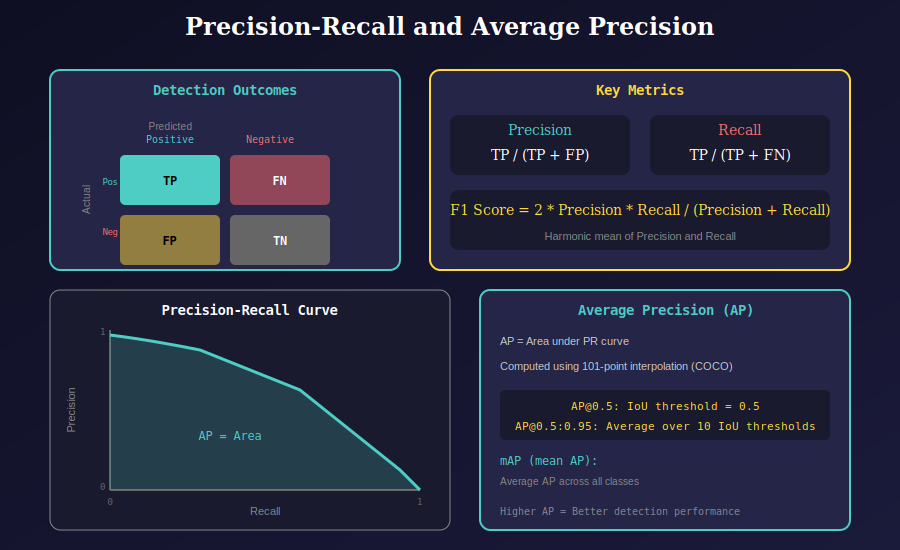

# Metrics Module (`metrics.py`)

This module implements evaluation metrics for object detection, including Precision, Recall, and Average Precision (AP) computation following the COCO evaluation protocol.

---

## 📊 Visual Overview

### 1. Precision-Recall Fundamentals

Understanding the core metrics for detection evaluation.



**Detection Outcomes:**

| Outcome | Description |
|---------|-------------|
| **TP (True Positive)** | Correct detection (IoU ≥ threshold) |
| **FP (False Positive)** | Wrong detection (IoU < threshold or duplicate) |
| **FN (False Negative)** | Missed ground truth |
| **TN (True Negative)** | Correctly rejected (not used in detection) |

**Key Formulas:**

$$Precision = \frac{TP}{TP + FP}$$

$$Recall = \frac{TP}{TP + FN}$$

$$F1 = 2 \cdot \frac{Precision \cdot Recall}{Precision + Recall}$$

---

### 2. Average Precision Computation

The complete pipeline for computing AP using the COCO protocol.


**Pipeline Steps:**

1. **Sort by Confidence**: Rank detections by confidence score (descending)
2. **Per-Class Loop**: Process each class independently
3. **Compute P/R Curves**: Calculate cumulative TP/FP and derive precision/recall
4. **101-Point Interpolation**: Integrate area under PR curve

---

## 🔧 Functions

### `smooth(y, f=0.05)`

Box filter for smoothing curves.

```python
def smooth(y, f=0.05):
    """
    Apply box filter smoothing.
    
    Args:
        y: Input array to smooth
        f: Filter fraction (default: 0.05)
    
    Returns:
        Smoothed array
    """
    nf = round(len(y) * f * 2) // 2 + 1  # filter size (must be odd)
    p = numpy.ones(nf // 2)
    yp = numpy.concatenate((p * y[0], y, p * y[-1]), 0)
    return numpy.convolve(yp, numpy.ones(nf) / nf, mode='valid')
```

### `compute_ap(tp, conf, pred_cls, target_cls, eps=1e-16)`

Compute Average Precision following COCO protocol.

```python
def compute_ap(tp, conf, pred_cls, target_cls, eps=1e-16):
    """
    Compute Average Precision.
    
    Args:
        tp: True positives [N, 10] for 10 IoU thresholds
        conf: Confidence scores [N]
        pred_cls: Predicted classes [N]
        target_cls: Ground truth classes [M]
        eps: Numerical stability epsilon
    
    Returns:
        Tuple: (tp, fp, precision, recall, mAP50, mAP)
    """
```

---

## 📁 Module Structure

```
utils/
├── metrics.py               # Main module
└── metrics/
    └── docs/
        ├── README.md        # This documentation
        ├── 01_precision_recall.svg
        └── 02_ap_computation.svg
```

---

## 📊 COCO Evaluation Protocol

### IoU Thresholds

COCO uses 10 IoU thresholds for AP computation:

| Threshold | Description |
|-----------|-------------|
| 0.50 | AP@0.5 (PASCAL VOC style) |
| 0.55 | - |
| 0.60 | - |
| 0.65 | - |
| 0.70 | - |
| 0.75 | AP@0.75 (strict) |
| 0.80 | - |
| 0.85 | - |
| 0.90 | - |
| 0.95 | Very strict |

**Primary Metrics:**
- `AP` (mAP@0.5:0.95): Mean AP across all 10 thresholds
- `AP50`: AP at IoU=0.5
- `AP75`: AP at IoU=0.75

---

## 📊 Output Format

```python
tp, fp, precision, recall, map50, mean_ap = compute_ap(tp, conf, pred_cls, target_cls)
```

| Output | Shape | Description |
|--------|-------|-------------|
| `tp` | `[nc]` | True positives per class |
| `fp` | `[nc]` | False positives per class |
| `precision` | `scalar` | Mean precision at best F1 |
| `recall` | `scalar` | Mean recall at best F1 |
| `map50` | `scalar` | mAP at IoU=0.5 |
| `mean_ap` | `scalar` | mAP@0.5:0.95 |

---

## 💡 Key Implementation Details

### 1. Precision Envelope

```python
# Make precision monotonically decreasing
m_pre = numpy.flip(numpy.maximum.accumulate(numpy.flip(m_pre)))
```

This ensures valid interpolation by taking the maximum precision at each recall level moving from right to left.

### 2. 101-Point Interpolation

```python
x = numpy.linspace(0, 1, 101)  # COCO standard
ap = numpy.trapz(numpy.interp(x, m_rec, m_pre), x)
```

Uses trapezoidal integration over 101 equally-spaced recall points.

### 3. Best F1 Selection

```python
f1 = 2 * p * r / (p + r + eps)
i = smooth(f1.mean(0), 0.1).argmax()
```

Finds the confidence threshold that maximizes F1 score.

---

## 📚 References

1. **COCO Evaluation**: Lin et al., "Microsoft COCO: Common Objects in Context" (ECCV 2014)
   - Paper: https://arxiv.org/abs/1405.0312

2. **Object Detection Metrics**: Padilla et al., "A Survey on Performance Metrics for Object-Detection Algorithms"
   - Paper: https://github.com/rafaelpadilla/Object-Detection-Metrics

3. **PASCAL VOC**: Everingham et al., "The PASCAL Visual Object Classes Challenge" (IJCV 2010)

---

## 🎯 Usage Example

```python
from utils.metrics import compute_ap, smooth

# Assume we have detection results
# tp: [N, 10] - True positive flags for 10 IoU thresholds
# conf: [N] - Confidence scores
# pred_cls: [N] - Predicted class indices
# target_cls: [M] - Ground truth class indices

tp, fp, precision, recall, map50, mean_ap = compute_ap(
    tp, conf, pred_cls, target_cls
)

print(f"mAP@0.5: {map50:.4f}")
print(f"mAP@0.5:0.95: {mean_ap:.4f}")
print(f"Precision: {precision:.4f}")
print(f"Recall: {recall:.4f}")
```

---

## ⚙️ Typical Performance Ranges

| Model | mAP@0.5 | mAP@0.5:0.95 |
|-------|---------|--------------|
| YOLOv8n | 37.3 | 52.6 |
| YOLOv8s | 44.9 | 61.8 |
| YOLOv8m | 50.2 | 67.2 |
| YOLOv8l | 52.9 | 69.8 |
| YOLOv8x | 53.9 | 71.0 |

*Scores on COCO val2017*

---

## 📚 Navigation

| Previous | Up | Next |
|:---------|:--:|-----:|
| [← EMA](../../ema/docs/README.md) | [🏠 Utils](../../README.md) | [Meters →](../../meters/docs/README.md) |

